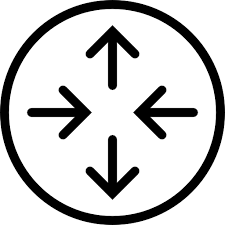
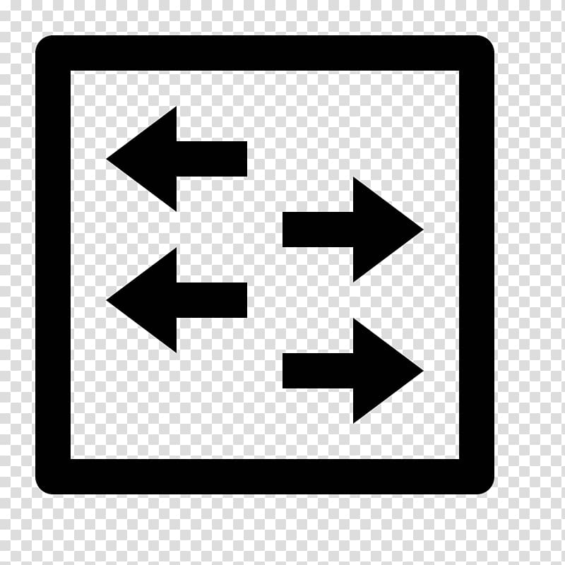
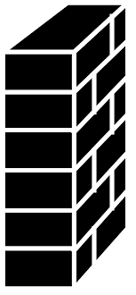
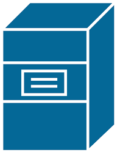
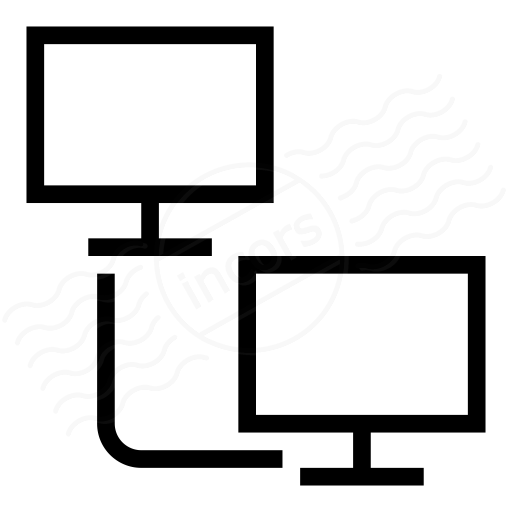

# Note

## 1. Network Devices

- A `computer network` is a digital telecommunications network which allows nodes to share resources.

### Symbols

#### Router

#### Switch

#### Firewall

#### Server

#### Client

