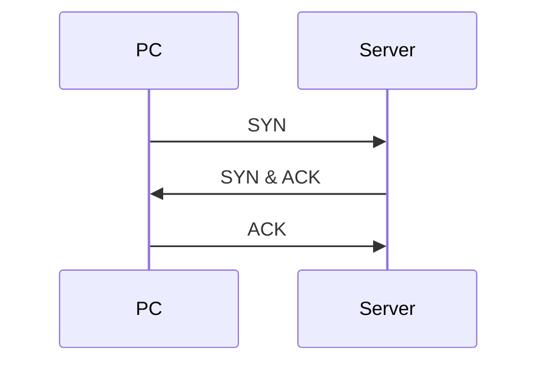
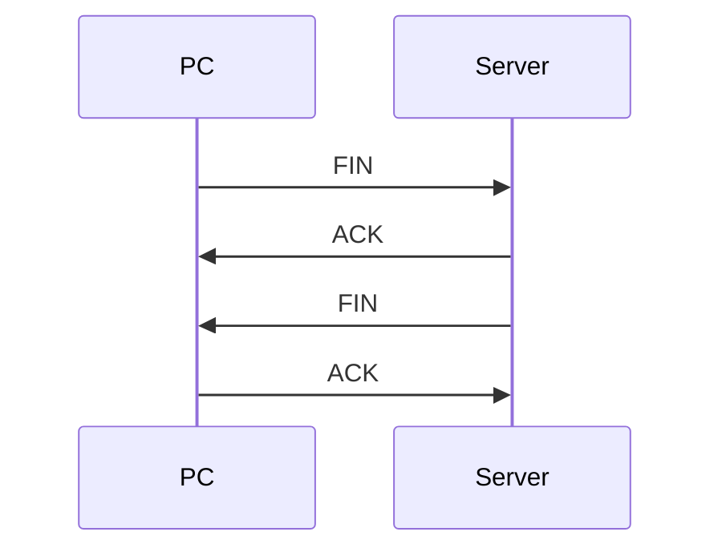

# Note

## 1. Network Devices

- A `computer network` is a digital telecommunications network which allows nodes to share resources.

### Devices in Network

#### Client & Server

- A `client` is a device that accesses a service made available by a server.
- A `server` is a device that provides functions or services for clients.
- Same device can both be a client and a server.

#### Switches / Routers

- Number of network interfaces / ports
  - Switch: Many
  - Router: Few
- Connectivity
  - Switch: to hosts within the same LAN and no connectivity between LAN or over the internet
  - Router: between LANs and used to send data over the Internet

#### Firewalls

- monitor and control network traffic based on configured rules
- can be placed inside or outside network

- `Next-generation firewalls` include more modern and advanced filtering capabilities.
- `Network firewalls` are hardware devices that filter traffic between networks.
- `Host-based firewalls` are software applications that filter traffic entering and exiting a host machine.

## 2. Interfaces and Cables

### Ethernet

- `Ethernet` is a collection of network protocols / standards.
- We need standards like Ethernet so that they have an agreed language that machines can talk to each other.
- `Ethernet standard` is defined in the IEEE 802.3 standarad in 1983.
  - IEEE is Institute of Electrical and Electronics Engineers.

| **Speed** | **Common Name**  | **IEEE Standard** | **Informal Name** | **Max Cable Length** |
| :-------: | :--------------: | :---------------: | :---------------: | :------------------: |
|  10 Mbps  |     Ethernet     |      802.3i       |     10 BASE-T     |         100m         |
| 100 Mbps  |  Fast Ethernet   |      802.3u       |    100 BASE-T     |         100m         |
|  1 Gbps   | Gigabit Ethernet |      802.3ab      |    1000 BASE-T    |         100m         |
|  10 Gbps  | 10 Gig Ethernet  |      802.3an      |    10G BASE-T     |         100m         |

- BASE refers to baseband signaling and T stands for twisted pair
- 100m is the maximum for twisted pair cables.

### UTP Cable

- `UTP (Unshielded Twisted Pair) cables` are copper wire cables under Ethernet standards.
  - No metallic shield so it's vulnerable to electrical interference.
  - But twisted pairs protect against EMI (Electrical Magnetic Interference)
- `RJ-45` is the connector used at the ends of a copper Ethernet cable.

  - Has 8 pins but 10, 100 BASE-T only use 2 pairs (4 pins) and other two use all.
  - Use pin 1 and 2 to transmit data (Tx) and 3 and 6 to receive data (Rx).
    - It's the opposite for switches.
    - Pair of pins to allow `full-duplex transmission`, meaning that both devices can send and receive data at the same time and experience no collision.
  - In 1000 BASE-T and 10G BASE-T, the pairs are bidirectional so each pair isn't dedicated specifically for transmitting or receiving.

- In `Straight-through cable`, pins are connected to the same number pin.
- `Crossover-cable` has reversed pin connections.
- Modern networking devices have a feature called `Auto MDI-X` that allows devices to automatically detect which pins their neighbour is transmitting and adjust which pins they use to transmit and recieve data.

### Fiber-Optic Connections

- `SFP (Small Form-Factor Pluggable) transceiver` is used for fiber optic cables.
- Fiber optic cables send data by sending light over glass fibers.
- There are two connectors at each end; one for transmitting and one for receiving.
- Inside of fiber-optic cable, it consists of 4 layers:
  1. Fiber glass cores: light transmitted here
  2. Cladding: reflects light
  3. Protective buffer: protects fiber glass from breaking
  4. Outer jacket

#### Multi-mode vs. Single-mode

- Multi has wider core than single.
- Multi allows multiple angles of light wave but single only allows one angle.
- Multi allows longer cable than UTP but shorter than single.
- Multi is cheaper than single due to LED based SFP and single is expensive due to laser based SFP.

#### Standards

| **Speed** | **IEEE Standard** | **Informal Name** | **Cable Type** | **Max Cable Length** |
| :-------: | :---------------: | :---------------: | :------------: | :------------------: |
|  1 Gbps   |      802.3z       |   1000 BASE-LX    | Multi / Single | 500m (MM) / 5km (SM) |
|  10 Gbps  |      802.3ae      |    10G BASE-SR    |     Multi      |         400m         |
|  10 Gbps  |      802.3ae      |    10G BASE-LR    |     Single     |         10km         |
|  10 Gbps  |      802.3ae      |    10G BASE-ER    |     Single     |         30km         |

### UTP vs Fiber Optic

- UTP is cheaper than fiber optic.
- UTP covers shorter distance than fiber optic.
- UTP is vulnerable to EMI but fiber optic is not.
- RJ45 is cheaper than SFP.
- UTP emits a faint signal outside which can be security risk.

## 3. OSI Model & TCP/IP Suite

- `Networking models` categorize and provide a structure for networking protocols and standards.
- `Protocols` are a set of rules defining how network devices and software should work.

### OSI (Open Systems Interconnection) Model

- A conceptual model that categorizes and standardizes the different functions in a network.
- Created by International Organization for Standardization (ISO).
- 7 Layers work together to make the network work.
  1. Physical
  2. Data Link
  3. Network
  4. Transport
  5. Session
  6. Presentation
  7. Application
- When sending data to another, the data is first processed through the OSI stack, each layer adding something to original (`encapsulation`).
- Then, at the physical layer, it's sent to another as electrical signal and it strips off the layers up the OSI stack. (`de-encapsulation`)
- Both encapsulation and de-encapsulation are examples of `adjacent-layer interaction`.
- `Same-layer interaction` is when the same layer of two systems interact.

#### Application Layer

- Layer that interacts with software applications like browser.
- HTTP and HTTPS are examples of layer 7 protocols.
- Functions:
  - Identifying communication partners
  - Synchronizing communication

#### Presentation Layer

- Translates between application and network formats.
- One example is encryption and decryption of data.
- Also it translates between different application layer formats.

#### Session Layer

- Controls dialogues (`sessions`) between communicating hosts.
- Establishes, manages and terminates connections between the local application and the remote application.

#### Transport Layer

- Segments and re-assembles data for communications between end hosts.
- Provide `host-to-host` communication.
- Layer 4 header is added at this layer and the PDU is called `segment`.

#### Network Layer

- Provides connectivity between end hosts on different networks outside LAN.
- Provides logical addressing like IP addresses.
- Provides path selection between the source and the destination.
- Routers operate at this layer.
- Layer 3 header is added with information like source and destination IP address.
- The PDU is called a `packet`.

#### Data Link Layer

- Provides `node-to-node` connectivity and data transfer.
- Defines how data is formatted for transmission over physical medium.
- Detects and corrects physical layer errors.
- Switches operate at this layer.
- Layer 2 header and trailer is added.
- The PDU is called `frame`.

#### Physical Layer

- Defines physical characteristics of the medium used to transfer data between devices, i.e. voltage levels, maximum transmission distance, cable specification, etc.
- Digital bits are converted into eletrical (for wired transmission) or radio (for wireless transmission) signals.
- PDU is called `bit`.

### TCP/IP Suite

- Conceptual model and set of communications protocols used in Internet and other networks.
- Developed by the United States Department of Defence.
- Smilar structure to OSI model but has fewer layers.
- It's in use in modern networks but OSI model still influences how network engineers think and talk about networks.

1. Link - Equivalent to data link and physical layers of OSI
2. Internet - Eqivalent to Network layer
3. Transport - Same as OSI
4. Application - All upper layers in OSI

## 4. Intro to the CLI

### Connecting to the Device

- In order to configure a device, you have to connect to the console port, which has RJ45 and USB ports.
- `Rollover cable` is used for connection, that has RJ45 and DB9 ends.
- They have 8 pins as well but they connect in different pairs of 1-8. 2-7, 3-6, 4-5.

### User EXEC mode

- This is the mode set by default, when you first enter the CLI.
- `Name>` indicates that you are in user EXEC mode.
- Users can look at things, but can't make any changes.

### Previleged EXEC mode

- By entering `enable`, user can enter previleged EXEC mode
- `Name#` indicates that you are in previleged EXEC mdoe.
- Provides complete access to view the device's configuration, restart the device, etc.
- Cannot change config itself but can save config file, etc.

### Global Configuration mode

- Enter `configure terminal` to enter global configuration mode from previleged EXEC mode.
- `Name(config)#` indicates this mode.

- You can set password by `enable password` command.
  - It uses Cisco's default 7 hash algorithm which is not too secure.
  - `service password-encryption` encrypts passwords in config.
- `enable secret` is more secure as it uses MD5 hash and it takes precedence over password

### CLI Commands

- You can type `?` to view available commands (e.g. `e?` shows all commands that start with e).
  - The commands that are all capital from suggestions of `?` indicate a variable.
  - `<cr>` indicates that there are no available commands.
- Tab will auto-complete what you are typing but you don't necessary have to type the whole thing because CLI can infer the command.
- `exit` command to exit configuration or previleged mode.
- Typing `no` in front of command will undo the command.
- `do` command executes command in previleged EXEC level from global configuration mode.

### Configuration files

- `Running-config`: current, active configuration file on the device.
- `Startup-config`: the config file that will be loaded upon restart.
- `write`, `write memory` or `copy running-config startup-config` will all write the running-config to startup-config.

## 5. Ethernet LAN Switching (1/2)

### Ethernet Frame

- Header consists of 5 parts: preamble, SFD, destination, source and type / length.
- Trailer only has FCS.
- Total of 26 bytes.

#### Preamble

- 7 bytes of alternating 1s and 0s (10101010 \* 7)
- Allows devices to synchronize receiver clocks.

#### SFD (Start Frame Delimiter)

- 1 byte of 10101011
- Marks the end of preamble and beginning of rest of the frame.

#### Destination & Source

- Indicates the devices sending and receiving the frame.
- Consist of 6 byte `MAC address` of the physical device.

#### Type / Length

- 2 byte field
- A value of 1500 or less indicates length of encapsulated packet.
- Value of 1536 or greater indicates type of the encapsulated packet.
  - IPv4 = 0x0800
  - IPv6 = 0x86DD

#### FCS

- 4 bytes
- Detects corrupted data by running `CRC (Cyclic Redundancy Check)` algorithm over the received data.

### MAC (Media Access Control) Address

- 6-byte physical address assigned to the device when it is made
- also known as `burned-in address` and is globally unique
- First 3 bytes are `OUI (Organizationally Unique Identifier)`, which is assigned to company making the device.
- Last 3 bytes are unique to the device itself.

### Finding out MAC Address

- Switch has a `MAC address table`, which saves mapping of interface to source MAC address when it receives data.
  - When MAC address is saved this way it's called `dynamic / dynamically learned MAC address`.
  - MAC addresses are removed after 5 minutes of inactivity (`aging`).
- When switch encounters a MAC address destination not saved in the table, it floods the frame, which is sending the frame to all interfaces except the source.
  - It's called `unknown unicast frame` when the MAC address is not in the table.
  - `Unicast frame` is a frame destined for a single target.
- If the received end doesn't have a matching MAC address, it simply drops the packet, but if it does, it processes it normally.

## 6. Ethernet LAN Switching (2/2)

### Minimum size of Ethernet Frame

- Minimum size of Ethernet frame is 64 bytes, meaning that minimum payload size is 46 bytes (if don't count preamble and SFD as the header).
- If payload is less than 46 byes, padding bytes of all 0s are added.

### ARP (Address Resolution Protocol)

- Used to discover MAC address of a known IP address.
- Consists of two messages:
  1. `ARP request`: broadcast that is sent to all hosts, it has `FFFF.FFFF.FFFF` destination MAC address which is broadcast MAC.
  2. `ARP reply`: unicast sent only to the host
- PC stores ARPs in `ARP table`.
  - `arp -a` command to view ARP table
  - Static type is default entry in ARP table and dynamic type is the ones learned via ARP.

### Ping

- A network utility that is used to test reachability
- Measures round-trip time
- Uses two messages like ARP:
  1. `ICMP Echo Request`: sent to specific host not broadcast
  2. `ICMP Echo Reply`
- Command: `ping <ip-address>`

### Cisco Commands

- To see ARP table: `show arp`
- To view MAC address table: `show mac address-table`
- To remove MAC addresses from table: `clear mac address-table dynamic`
  - Target specific address: `clear mac address-table dynamic address <mac-address>`
  - Target specific interface: `clear mac address-table dynamic interface <interface-id>`

## 7. IPv4 Addressing (1/2)

### IPv4 Addresses

- Consists of 4 groups of 8 bits number (0 - 255)
- Written in dotted decimal for easier human understanding.
- `/24` means that first 24 bits represent the network and rest is end host.
- First end host eddress (host portion is all 0s) is the `network address` so can't be assigned.
- Last end host eddress (host portion is all 1s) is the `broadcast address` so can't be assigned.

### IPv4 Classes

| **Class** | **First Octet** | **First Octet Range** |
| :-------: | :-------------: | :-------------------: |
|     A     |    0XXXXXXX     |        0 - 127        |
|     B     |    10XXXXXX     |       128 - 191       |
|     C     |    110XXXXX     |       192 - 223       |
|     D     |    1110XXXX     |       224 - 239       |
|     E     |    1111XXXX     |       240 - 255       |

- Class D is reserved for `multicast addresses`.
- Class E is reserved for `experimental use`.

### Loopback addresses

- Has range between 127.0.0.0 - 127.255.255.255
- Used to test network stack on local device. If device sends traffic to this address, it's simply processed back up TCP/IP stack as if it were traffic received from another device.

### Netmask

| **Class** | **Prefix Length** |  **Netmask**  |
| :-------: | :---------------: | :-----------: |
|     A     |        /8         |   255.0.0.0   |
|     B     |        /16        |  255.255.0.0  |
|     C     |        /24        | 255.255.255.0 |

- `Netmask` is older way of telling which part is the network.

## 8. IPv4 Addressing (2/2)

### Network number calculation

- Maximum number of hosts per network is `2^n - 2` where n is the number of host bits.
- First usable address is the address 1 bit after network address.
- Last usable address is the address 1 bit before the broadcast address.

### `show ip interface brief`

- Gives status of each interface as well as IP addresses.
- `Interface` column lists network interfaces.
- `IP address` column shows the IP address but it will be `unassigned` if not configured.
- `OK?` column is legacy feature to tell if IP address is valid.
- `Method` column indicates the method by which the interface was assigned with IP address.
- `Status` column is layer 1 status of interface.
  - `connected` means it's up
  - `administratively down` means disabled with `shutdown` command; this is default status of router but not for the switches
- `Protocol` column is the layer 2 status. Can be up or down.

### Setting up IP address

- Can enter `configuration interface` mode by typing `interface <id>`.
- `name(config-if)#` at the beginning of the line indicates this mode.
- Setting up IP address can be done by `ip address <address> <subnet mask>`.
- `no shutdown` command is required afterwards to enable the interface.

### Other commands

- `show interfaces <interface-id>` shows extensive information mainly about layer 1 and 2 about the interface.
- `show interfaces description` shows similar information to `show interfaces brief` but has description column that can be manually set about the interface.
- `description <string>` command sets description of interface in `config-if` mode.

## 9. Switch Interfaces

- Switches have way more interfaces especially RJ45 ports than routers because it's where the end hosts are connected to.

### `show ip interface brief`

- Switch interfaces don't have the shutdown command defined so they will be up / up state by default.
- down state is different from administratively down because it means it's not connected.

### `show interfaces status`

- `Port` field lists interfaces.
- `Name` field is description of the interface.
- `Status` field will show connected / not connected.
- `VLAN` field will show the VLAN which can be used to divide LANs into smaller ones.
- `Duplex` field will show duplex status.
  - It's auto by default meaning it will negotiate with the neighbouring device and use full if possible.
  - `a-` means it's chosen automatically.
- `Speed` field shows the speed of the transmission and it's also `auto` by default.
  - It will negotiate with the device and use the fastest speed possible.
- `Type` field are all RJ45 interfaces for copper UTP cables but if they were SFP, you would see here too.

### Configuring speed and duple

- First enter `config-if` mode by entering `interfaces <id>`.
- `speed <speed>` command can set the speed.
- `duplex <mode>` command can set the duplex mode.
- `description <string>` command can set the name field.

### `interface range <range>`

- This command can enter `config-if-range` mode where my changes apply to all interfaces in this range.
- `f0/5 - 12` can apply my changes to all between 5 and 12.
- It doesn't have to be consecutive, e.g. `f0/5 - 6, f0/9 - 12`.

### Full / Half Duplex

- `Half duplex`: The device can't send and receive data at the same time. If it is receiving a frame, it must wait before sending a frame.
- `Full duplex`: The device can send and receive data at the same time. It doesn't have to wait.

### LAN Hubs

- Before switches were used, hubs were used in the old days.
- The hubs are simple repeaters that flood any frame they receive and they operate at layer 1.
- The problem with it is that when it receives frames at the same time, it will try to send them at the same time resulting in collision.
- `CSMA/CD` (Carrier Sense Multiple Access with Collision Detection) is a mechanism used to prevent this.
  - Before sending frames, devices listen to the collision domain until they detect that other devices are not sending.
  - If a collision does occur, the device sends a jamming signal to inform other devices that collision happened.
  - Each device will wait a random period of time before sending frames again.
- Devices connected together via Hub is said to belong to the same `collision domain`.
  - Switches don't try to send the message at the same time so the connected hosts are in separate collision domains.
  - This makes full-duplex possible so switch is used in these days.

### Speed / Duplex Autonegotiation

- Interfaces that can run at different speeds have default settings of speed auto and duplex auto.
- Interfaces advertise their capabilities to the neighbouring device, and they negotiate the best speed and duplex settings they are both capable of.
- If autonegotiation is disabled:
  - The switch will try to sense the speed other device is operating at.
    - If failed to sense, it will use the slowest speed.
  - If speed is 10 or 100 Mbps, it will use half duplex.
  - If speed is 1000 Mbps or higher, it will use full duplex.
- If PC operates at full jduplex but switch operate at half duplex or vise versa, duplex mismatch happens and collisions will occur.

### Interface Errors

- The following errors can be viewed via `show interfaces <interface-id>` command.
- `Runts`: frames that are smaller than the minimum frame size (64 bytes).
- `Giants`: frames that are larger than the maximum frame size (1518 bytes).
- `CRC`: frames that failed the CRC check.
- `Frame`: frames that have incorrect format due to error.
- `Input errors`: total number of various counters, such as the above four.
- `Output errors`: frames that the switch tried to send, but failed due to error.

## 10. IPv4 Header

### Version

- 4 bits
- Identifies the version of IP used
- IPv4 = 0100, IPv6 = 0110

### Internet Header Length (IHL)

- 4 bits
- The options field is variable in length so it's necessary to indicate the total length of the header.
- Identifies the length of header in 4-byte increments.
- Minimum value is 5 (=20 bytes) with no options field.
- Maximum value is 15 (=60 bytes).

### DSCP (Differentiated Services Code Point)

- 6 bits
- Used for QoS (Quality of Service)
- Used to prioritize delay-sensitive data (streaming video, voice, etc.)

### ECN (Explicit Congestion Notification)

- 2 bits
- Provides end-to-end notification of network congestion without droppping packets.
- Optional feature that requires both endpoints and underlying network infrastructure to support it.

### Total Length

- 16 bits
- Indicates the total length of the packaet (L3 header + L4 segment) measured in bytes
- Minimum value is 20
- Maximum value is 65535

### Identification

- 16 bits
- If packet is fragmented, it is used to identify which packet the fragment belongs to.
- All fragments of same packet will have same value in this field.
- Packets are fragmented if larger than `MTU (Maximum Transmission Unit)`, which is usually 1500 bytes. (Same as maximum size of Ethernet frame).
- Fragments are reassembled by the receiving host.

### Flags

- 3 bits
- Bit 0: reserved, always 0
- Bit 1: `Don't fragment (DF) bit`, used to indicate a packet that should not be fragmented
- Bit 2: `More fragments (MF) bit`, set to 1 if there are more fragments in the packet, set to 0 for the last fragment.

### Fragment Offset

- 13 bits
- Used to indicate the position of the fragment within the original unfragmented IP packet.
- Allows fragmented packets to be reassembled even if the fragments arrive out of order.

### Time to Live

- 8 bits
- Router will drop a packet with a TTL of 0.
- Used to prevent infinite loops.
- Originally designed to indicate the packet's maximum lifetime in seconds.
- In practice, it indicates `hop count`, each time the packet arrives at a router, the router decreases TTL by 1.
- Recommended default is 64.

### Protocol

- 8 bits
- Indicates the protocol of the encapsulated L4PDU.
- TCP = 6, UDP = 17, ICMP = 1, OSPF(dynamic routing protocol) = 89

### Header Checksum

- 16 bits
- Used to check for errors in IPv4 header
- When router receives packet, it calculates the checksum of header and compares with it.
- If they do not match, router drops the packet.

### Source / Destination IP Address

- 32 bits
- Contains IPv4 address of sender and receiver of the packet

### Options

- 0 - 320 bits
- Rarely used

## 11.1. Routing Fundamentals

### What is routing?

- `Routing` is a process that routers use to determine the path that IP packets should take over a network to reach their destination.
  - Routers store routes to all of known destinations in a `routing table`.
- 2 routing methods (methods that routers use to learn routes):
  - `Dynamic routing`: routers use dynamic routing protocols to share routing information with each other automatically and build their routing tables.
  - `Static routing`: Admins manually configure routes on the router.
- A route basically tells the router: to send packet to X, send it to next hop Y.
  - If destination is directly connected to router, send it to the destination.
  - If destination is router's own IP, receive the packet.

> `WAN (Wide Area Network)` is a network that extends over a large geographical area.

### `show ip route`

- `show ip route` in previleged mode of router shows the routing table.
- Codes legend lists different protocols which routers can use to learn routes.
- When you configure IP address and enable it with `no shutdown`, connected and local routes will automatically be added.

### Connected and Local Routes

- `Connected Route (C)` is a route to the network the interface is connected to.
  - It provides route to all hosts in that network.
- `Local Route (L)` is a route to the exact IP address configured on the interface.
  - /32 netmask is used to specify the exact IP address of the interface.
  - /32 means all 32 bits are fixed, so they can't change.

### Route Selection

- When there are more than one route that matches the destination IP address, it will choose the most specific matching route.
  - Most specific matching route = matching route with longest prefix length
- You will see in `show ip route`, `192.168.1.0/24 is variably subnetted 2 subnets, 2 masks`
  - This means that there are two routes to subnets that fit within the network with two different netmasks.

> Unlike switches, if router doesn't have the route in the routing table it will just drop the packet instead of flooding.

## 11.2. Static Routing

### Default Gateway

- End hosts can send packets directly to destinations in connected network.
- But to send packets outside local network, they must send to default gateway.
- Also called default route.
- The packet sent to another network will have detination IP address of host in another network but MAC address of default gateway. which can be learned via ARP request.

### Static Route Configuration

- Each router in the path need both routes of source and destination network, to ensure `two-way reachability` (can send packets both ways).
- From global config mode type `ip route <ip-address> <netmask> <next-hop>` to configure the static routes.
- Configuration can be tested via ping command and if successful, it means there is two-way reachability.
- You can configure static route with exit-interface instead of next-hop as well
  - This tells which interface it should send the packet out of.
  - Both exit-interface and next-hop can be configured (recommended).
  - Static routes with only exit-interface rely on a feature called `Proxy ARP`.

### Default Route

- If the router doesn't have any more specific routes that match a packet's destination IP address, the router will forward the packet using default route.
- It's set as a route to 0.0.0.0/0
  - It is least specific route possible because it includes all IP addresses.
- Often used to direct traffic to Internet.
- When not set, routing table will display `gateway of last resort is not set`.
- Setting default route is done by `ip route 0.0.0.0 0.0.0.0 <next-hop>`

## 12. Life of a Packet

> Each interface in device has a unique MAC address

- When PC is sending a packet to another network, it first sends it to router but when it doesn't know the MAC address of the router, it sends ARP request to find out.
- When router receives a packet it de-encapsulates and encapsulates with header of new destination MAC address.
- At each stage, if the device doesn't know the MAC address of next hop, it must send ARP first.

## 13. Subnetting (Part 1)

### IPv4 Address Classes

- The IANA (Internet Assigned Numbers Authority) awssigns IPv4 addresses to companies based on size.
  - Large company receive a class A network and small for class C.
- But this led to many wasted IP addresses
- A direct, dedicated connection between two routers is called `point-to-point network`, but it only uses two hosts so it's wasted.

### CIDR (Classless Inter-Domain Routing)

- The requirements of class networks were removed and it can be any prefix length.
- This allowed larger networks to be split into smaller networks, allowing greater efficiency.
- These smaller networks are called `subnets`.
- It is possible to use /31 subnet for point-to-point network because there is no need for network or broadcast address.
- /number notation is called `CIDR notation`.

## 14. Subnetting (Part 2)

### Subnetting Tricks

- By adding the least bit of network portion of the octet repeatedly, we can find the network addresses of each subnet.
- `2^x = number of subnets` where x = number of borrowed bits.
- When given the number of subnets to make, find the least number of borrowed bits whose number of subnets is more than required.
- Finding network address of host, based on its IP address can be done by converting all host bits to 0.
  - Similarly, broadcast address can be found by converting all host bits to 1.

## 15. Subnetting (Part 3)

### VLSM (Variable-Length Subnet Masks)

- All subnetting in part 1 and 2 were `FLSM (Fixed-Length Subnet Masks)` meaning that all the subnets use the same prefix length.
- VLSM, on the other hand, is the process of creating subnets of different sizes, to make use of network addresses more efficiently.

### VLSM - Steps

1. Assign the largest subnet at the start of address space.
2. Assign the second largest subnet after.
3. Repeat the process until all subnets have been assigned.

> For CCNA test, use /30 prefix length instead of /31, for point-to-point network connection.

## 16. VLANs (Part 1)

### What is a LAN?

- `LAN` is a signle broadcast domain, including all devices in that broadcast domain.
- `Broadcast domain` is the group of devices which will receive a broadcast frame sent by any one of the members.

### What is a VLAN?

- Lots of unnecessary broadcast traffic in LAN can reduce network performance.
- Even within the same LAN, you might want to limit who has access to what. This can be applied in a router / firewall so can't be done in a same LAN.
- To address these issues, you can configure VLANs on switch interfaces so that switch cannot forward traffic between LVANs, including broadcast.
- The switch does not perform inter-VLAN routing so it must send the traffic through the router first.

- `VLANs`
  - are configured on switches on a per-interface basis.
  - logically separate end hosts at Layer 2.

### VLAN configuration

- You can see VLAN configurations by `show vlan brief`.
- VLANs 1, 1002 - 1005 exist by default and can't be deleted.
- To configure VLAN, first enter config-if-range mode of all interfaces that you want to group.
- Then, use `switchport mode access` command to change the ports to access port.
- Then `switchport access vlan <number>` to assign VLAN to the range of ports.
- Can enter `vlan <number>` to create a VLAN or enter `config-vlan` mode of existing VLAN.
  - Then inside, you can type `name <name>` to assign a name to the VLAN.

### Switchport modes

- `Access port` is a switchport which belongs to a single VLAN, and usually connects to end hosts like PCs.
- `Trunk ports` are switchports which carry multiple VLANs.

## 17. VLANs (Part 2)

### Trunk Ports

- You can use `trunk ports` to carry traffic from multiple VLANs over a single interface.
- Switches will tag all frames that they send over a turnk link.
  - This allows the receiving switch to know which VLAN the frame belongs to.
  - This is why: Trunk ports = tagged ports, access ports = untagged ports

### VLAN Tagging

- There are two main trunking protocols:
  - `ISL (Inter-Switch Link)` is an old Cisco proprietary protocol created before but not used anymore.
  - `IEEE 802.1Q (dot1Q)` is an industry standard protocol.

### 802.1Q Tag

- Dot1q tag is inserted between the source MAC address and the type/length field of the Ethernet frame.
- Tag is 4 bytes in length.
- It has two fields: `Tag Protocol Identifier (TPID)` and `Tag Control Information (TCI)`.

#### TPID

- 16 bits
- Always set to `0x8100`, indicating it's 802.1Q-tagged.

#### TCI

- Consists of 3 parts

- `PCP (Priority Code Point)`
  - 3 bits
  - Used for Class of Service (CoS), which prioritizes important traffic in congested networks.
- `DEI (Drop Eligible Indicator)`
  - 1 bit
  - Indicate frame that can be dropped if network is congested.
- `VID (VLAN ID)`
  - 12 bits
  - Identifies the VLAN the frame belongs to

### VLAN Ranges

- VLANs 0 and 4095 are reserved and can't be used.
- Actual range of VLAN is 1 - 4094.
- `Normal VLANs`: 1 - 1005
- `Extended VLANs`: 1006 - 4094
  - Some older switches might not use extended VLAN range.

### Native VLAN

- The native VLAN is VLAN 1 by default on all trunk ports.
- Can be configured via `switchport trunk native vlan <no.>`
- The switch does not add an 802.1Q tag to frames in the native VLAN.
- When a switch receives an untagged frame on a trunk port it assumes the frame belongs to the native VLAN.
- Therefore, it's important that the native VLAN matches between switches.

### Trunk Configuration

- `swtichport mode trunk` sets the interface as the trunk port.
  - You must first set the encapsulation to 802.1Q if it supports ISL as well, done by `switchport trunk encapsulation dot1q`.
- `switchport trunk allowed vlan <range>` can configure the allowed VLANs. This is for security and performance.
  - `switchport trunk allowed vlan add <no>` adds VLAN to allowed list.
  - `switchport trunk allowed vlan remove <no>` removes VLAN from allowed list.
  - `switchport trunk allowed vlan all` allows all VLANs (default state).
  - `switchport trunk allowed vlan except <range>` allows all VLANs except the ones specified.
  - `switchport trunk allowed vlan none` does not allow any VLAN.
- For security, it's best to change native VLAN to unused VLAN, and make it match between switches.
- `show vlan brief` only shows access ports assigned so use `show interfaces trunk` to view trunk ports.

### Router on a Stick (ROAS)

- You can divide one interface to `subinterfaces` so that each VLANs can each connect to router via subinterface.
- You can enter config-subif mode via `interface <interface-id>.<subinterface-number>` command.
- It is recommended to match subinterface number with VLAN number.
- `encapsulation dot1q <vlan-number>` command tells subinterface to behave as if it arrived on interface if frame is tagged with the VLAN number.
- Then, you must assign IP address to the subinterface.

## 18. VLANs (Part 3)

### Native VLAN on a router (ROAS)

- There are 2 ways to configure native VLAN on a router:
  1. Use `encapsulation dot1q <vlan-id> native` on the router subinterface.
  2. Configure the IP address for the native VLAN on the router's physical interface.

### Layer 3 (Multilayer) Switch

- Capable of both switching and routing (layer 3 aware)
- Can assign IP addresses to its interfaces
- Can create virtual interfaces for each VLAN and assign IP addresses to those interface
- Can configure routes on it, like a router and can be used for inter-VLAN routing
- Preferred over ROAS for inter-VLAN routing in large network because lots of traffic in one interface can cause congestion.

### SVIs (Switch Virtual Interfaces)

- Virtual interfaces you can assign IP addresses to in a multilayer switch.
- Configure each PC to use as their gateway address
- To send traffic to different subnets / VLANs, the PCs will send traffic to the switch and it will route the traffic.

### Inter-VLAN routing via SVI

- `ip routing` command enables layer 3 routing on the switch
- `no switchport` configures the interface as routed port (layer 3 port)
- Then, assign ip address to the interface just like the router interface
- Also configure default route as the router's interface
- SVIs are shutdown by default so you need to `no shutdown`

#### Conditions required for SVI to be up / up status

- VLAN must eist on the switch
- Switch must have at least one access or trunk port in the VLAN in up / up state
- VLAN and SVI must not be shutdown

## 19. DTP / VTP

### DTP (Dynamic Trunking Protocol)

- It's a Cisco proprietary protocol that allows, Cisco switches to dynamically determine their interface status without manual configuration.
- With DTP, we don't need to manually configure with switchport mode.
- For security, manual configuration is recommended. It should be disabled on all switchports.
- DTP will not form a trunk with a router, PC, etc. It will be in access mode by default.
- Enabled by default on all Cisco switch interfaces.
- Older switch defaults to dynamic desirable but newer ones default to dynamic auto.
- Negotiation is enabled by default and ISL is favoured in negotiation.
  - DTP frames are sent in VLAN1 in ISL or in native VLAN when using 802.1Q.
- Can disable DTP by:
  1. `switchport nonegotiate`
  2. Configuring it to an access port

#### DTP dynamic modes

- A switchport in `dynamic desirable` mode will actively try to form a trunk with other Cisco switches, i.e. if connected to other switchport with trunk, dynamic desirable or dynamic auto.
- A switchport in `dynamic auto` mode will not actively try to form a trunk with other switches but it will form a trunk if other switch is actively trying to form a trunk, i.e. if connected to trunk or dynamic desirable.

### Static and Dynamic Access

- `Static access` means an access port that belongs to a single VLAN that does not change.
- `Dynamic access` port is where a server automatically assigns the VLAN depending on the MAC address of the connected device.

### VTP (VLAN Trunking Protocol)

- VTP allows you to configure VLANs on a central VTP server switch and other switches (VTP clients) will synchronize their VLAN database to the server.
- Designed for large networks with many VLANs, so there is no need to configure each VLAN on every switch.
- Like DTP, it's not recommended to be used for security reasons.
- Cisco switches operate in VTP server by default.
- `show vtp status` reveals useful information about VTP
- Only VTPv3 supports VLANs in extended range

#### VTP Servers

- Can add/modify/delete VLANs
- Store VLAN database in NVRAM, so it's persisted even after turning off
- Will increase revision number everytime VLAN is added/modified/deleted
- Will advertise the latest version of database on trunk interfaces and VTP clients will sync their VLAN database.
- VTP servers will sync to another server with higher revision number.

#### VTP Clients

- Cannot add/modify/delete VLANs
- Does not store VLAN database in NVRAM (unless VTPv3)
- Will sync VLAN database to the server with highest revision number in VTP domain
- Will advertise and forward VTP advertisements to other clients over their trunk ports

#### VTP Transport

- Does not participate in VTP domain (does not sync)
- Maintains its own VLAN database in NVRAM. It can add/modify/delete VLANs, but they won't be advertised.
- Will forward advertisements

#### VTP Domain

- `vtp domain <name>` command changes the VTP domain name
- If a switch with no VTP domain receives a VTP advertisement with a VTP domain name, it will automatically join that domain.
- If a switch receives a VTP advertisement in the same VTP domain with a higher revision number, it will update its VLAN database to match.

> Changing VTP domain to unused domain or changing VTP mode to transparent will reset the revision number to 0.

## 20. Spanning Tree Protocol (Part 1)

### Network redundancy

- If one network component fails, you must ensure that other components will take over with little or no downtime.
- Most PCs only have a single NIC, so they can be plugged to one switch. However, important servers have multiple NICs so they can be plugged into multiple switches for redundancy.

### Broadcast Storm

- Ethernet headers don't have a TTL field, so some broadcast frames will loop around the network indefinitely for some network topologies.
- If enough of these accumulate, the network will be too congested for legitimate traffic. This is called `broadcast storm`.

### MAC Address Flapping

- When frames with same source MAC address arrive repeatedly from different interfaces, MAC address table is continuously updated.
- This is called `MAC address flapping`.

### Spanning Tree Protocol

- STP prevents layer 2 loops by placing redundant parts in a `blocking state`, essentially disabling the interfaces.
- These interfaces act as backups that can enter a `forwarding (normal) state`, if an active interface fails.
- Interfaces in a blocking state only send or receive `BPDUs (Bridge Protocol Data Units)`
- By selecting which ports are forwarding and which are blocking, STP creates a single path to/from each point in network, preventing layer 2 loops.

### Root bridge

- Switches use lowest `Bridge ID` field to elect a root bridge for the network.
- All ports on root bridge are put in forwarding state, and other switches must have a path to reach the root bridge.
- Bridge ID consists of:
  - 4 bits of `bridge priority`
  - 12 bits of VLAN ID
  - 48 bits of MAC address
- When a switch is first turned on, it assumes it's the root bridge until it recevies lower bridge ID BPDU.
- Once the topology converge and all switches agree on root bridge, only root bridge sends BPDUs and others will just forward BPDUs.

### STP Steps

1. The switch with lowest bridge ID is elected as the root bridge and all its ports are designated ports (forwarding state).
2. Remaining switches will select the interface with lowest root cost to be root port (in forwarding state).

- If same, use lowest neighbour bridge ID.
- If same, use lowest neighbour port ID.

3. Every collision domain must have a single STP designated port. Thus, each remaining collision domain will select one interface to be designated.

- One with lowest root cost or lowest bridge ID.

### Root Cost

- 10 Mbps = 100
- 100 Mbps = 19
- 1 Gbps = 4
- 10 Gbps = 2

## 21. Spanning Tree Protocol (Part 2)

### Spanning Tree Port States

- Root / Designated ports remain stable in forwarding state.
- Non-designated ports remain stable in blocking state.
- Listning / Learning are transitional states which are passed through when interface is activated or when blocking port must transition to forwarding due to change in topology.

#### Blocking State

- Effectively disabled to prevent loops
- Not send / receive network traffic
- Receive but not forward STP BPDUs
- Not learn MAC address

#### Listening State

- Only designated or root ports enter this state
- 15 seconds by default, determined by forward delay timer
- Only forwards / receives STP BPDUs
- Not send / receive regular traffic
- Not learn MAC address

#### Learning State

- Same as listening state but only difference is it learns MAC address

#### Forwarding state

- sends / receives BPDUs
- sends / receives regular traffic
- Learns MAC address

### Spanning Tree Timers

- STP timers on root bridge determine it for the entire network.

#### Hello

- How often the root bridge sends hello BPDUs
- Every 2 seconds

#### Forward Delay

- How long switch will stay in listening / learning states
- 15 seconds

#### Max Age

- How long will interface wait to change the STP topology after ceasing to receive Hello BPDUs
- 20 seconds (10 \* hello)

### STP Toolkit

#### Portfast

- Allows port to move immediately to forwarding state
- Must be enabled only on ports to end hosts
- `(config-if)# spanning-tree portfast` will enable it for the interface
- `(config)# spanning-tree portfast default` will enable it to all access ports

#### BPDU Guard

- Enabled interface will be shutdown on receiving BPDU to prevent loop from forming
- `(config-if)# spanning-tree bpduguard enable` enables it
- `(config)# spanning-tree portfast bpduguard default` enables it on all portfast ports

#### Root Guard

- Even if superior BPDU received, switch will not accept that as root bridge and interface will be disabled.

#### Loop Guard

- Even if the interface stops receiving BPDUs, it will not start forwarding. The interface will be disabled.

### Configure STP

- `(config)# spanning-tree mode <mode>` sets the mode of STP
- `(config)# spanning-tree vlan <number> root primary/secondary` sets the switch as primary or secondary root bridge for particular VLAN.
- `(config)# spanning-tree vlan <number> priorty <number>` manually sets the STP priority.

### STP Load-balancing

- Selecting Different root bridge per VLAN is recommended
- This is to make different interfaces used per VLAN and networks are less congested

### STP Port Settings

- `(config-if)# spanning-tree vlan <number> cost` configures root cost
- `(config-if)# spanning-tree vlan <number> port-priority` configures the port priority

## 22. Rapid Spanning Tree Protocol

### Spanning Tree Versions

- `Spanning Tree Protocol` (802.1D) from IEEE
  - Original STP
  - All VLANs share one STP so no load balancing
- `Per-VLAN Spanning Tree Plus (PVST+)` from Cisco
  - Each VLAN has its own STP instance
  - Can load balance by blocking different ports in each VLAN
- `Rapid Spanning Tree Protocol` (802.1w) from IEEE
  - Much faster at converging / adapting to network changes
  - All VLANs share one STP so can't load balance
- `Rapid PVST` from Cisco
  - Upgrade from Rapid STP to have each VLAN with STP
- Multiple Spanning Tree Protocol (802.1s)
  - Can group multiple VLANs into different instances to perform load balancing

### Rapid Spanning Tree Protocol

- Similarities between STP and RSTP
  - Both block specific ports to prevent layer 2 loops
  - Elect root bridge, root ports and designated ports with the same rules
- New root cost: 10 Mbps = 2 million, 100 Mbps = 200k, 1 Gbps = 20k...
- New Port States
  - `Discarding state` is new name for blocking state
  - Learning and forwarding states are only remaining in RSTP
- New Port Roles
  - Root port and designated port role remain the same
  - Non-designated port is split into alternate and backup port

### Functionalities Built into RSTP

- `BackboneFast`: allows switch to expire the max age timers on its interface and rapidly forward superior BPDUs.
- `UplinkFast`: allows backup port to be immediately made to root port when the root port fails

### Alternate port role

- Discarding port that receives a superior BPDU from another switch
- Functions as a backup to root port

### Backup port role

- Discarding port that receives a superior BPDU from another interface on the same switch
- Only happens when two interfaces are connected to same collision domain via a hub
- Functions as a backup for a designated port

### RSTP BPDU

- Version and type field of value 2
- Uses all 8 bits of flagsfor a negotitation process that allows STP to converge much faster
- All switches originate and send their own BPDUs from designated ports

### RSTP Protocol

- All switches send BPDU every hello time (2 seconds)
- Considers a neighbour lost if it misses 3 BPDUs, then flush all MAC addresses learned on that interface.

### RSTP Link Types

- `Edge`: a port connected to end host. Moves directly to forwarding
- `Point-to-point`: a direct connection between two switches
- `Shared`: connection to a hub. Must operate in half-duplex mode

## 23. Etherchannel

- `Access layer switch`: a switch that end hosts connect to
- `Distribution layer switch`: a switch that access layer switches connect to
- When the bandiwdth of the interfaces connected to end hosts is greater than the bandwidth of the connection to the distribution switches, it is called `oversubscription`.

### Etherchannel

- It groups multiple interfaces together to act as a single interface.
- STP will treat this group as single interface while receiving redundancy and increased bandwidth for having multiple interfaces.
- Other names: `port channel` and `LAG (Link Aggregation group)`

### Etherchannel load-balancing

- A `flow` is a communication between two nodes in the network.
- Frames in the same flow will be forwarded using same physical interface.
  - If frames of same flow are forwarded using different interface, they may arrive out of order.
- Source / destination MAC address or source / destination IP addresses are some inputs that can be used for interface selection calculation.

### Etherchannel configuration

- `# show etherchannel load-balance` shows current load balancing method
- `(config)# port-channel load-balance <method>` sets the load balancing method
- `(config-if-range)# channel-group <number> mode <mode>` to set etherchannel for range of interfaces
- `(config-if-range)# channel-protocol <pagp|lacp>` also exists to set protocol but it's not used
- `# show etherchannel port-channel` shows a virtual port-channel interface information
- `# show etherchannel summary` shows summary of etherchannel information

- Port configuration applied to an Etherchannel is applied to all of its ports.
- Member interfaces must have matching configurations for it to be valid.

#### Three Methods of Etherchannel Configuration

- `PAgP (Port Aggregation Protocol)`
  - Cisco proprietary
  - Dynamically negotiates creation / maintenance of etherchannel
  - Up to 8 interfaces can be formed into a Etherchannel
  - `auto` and `desirable` modes to configure it
- `LACP (Link Aggregation Control Protocol)`
  - Industry standard protocol
  - Dynamically negotiates creation / maintenance of etherchannel
  - Up to 16 interfaces can be formed into a Etherchannel but 8 active and 8 standby
  - `active` and `passive` modes to configure it
- `Static Etherchannel`
  - Interfaces are statically configured
  - Usually avoided
  - Up to 8 interfaces can be formed into a Etherchannel
  - `on` mode to configure it

#### Layer 3 Etherchannel

- Ports that will form layer 3 Etherchannel needs to be `routed ports` by entering `#(config-if-range) no switchport`
- Then, `(config-if-range)# channel-group <number> mode <mode>` will set them as Etherchannel
- Lastly, assign IP address to it by going to its interface configuration mode and entering `ip address`

## 24. Dynamic Routing

- `Network route`: a route to a network / subnet (mask length < /32)
- `Host route`: a route to a specific host (/32 mask)

### Dynamic routing

- Routers can use dynamic routing protocols to advertise information about the routes to other routers.
- They form `adjacencies` with neighbour routers to exchange this information

### Types of Dynamic Routing Protocols

#### IGP (Interior Gateway Protocol)

- Used to share routes within a signle autonomous system, which is like a single organization.
- Has two algorithm types:
  - `Distance Vector`
    - has following protocols:
      - `RIP (Routing Information Protocol)`
      - `EIGRP (Enhanced Interior Gateway Routing Protocol)`
    - Send their known destination networks and metrics to reach the known destinations to their directly connected neighbors
    - Routers doesn't know about the network beyond its neighbors (routing by rumor)
  - `Link State` has following protocols:
    - has following protocols:
      - `OSPF (Open Shortest Path First)`
      - `IS-IS (Intermediate System to Intermediate System)`
    - Every router creates connectivity map of the network.
    - Each router advertises about its interfaces to its neighbours and passed along until all routers develop the same map of the network.
    - Each router independently uses this map to calculate best routes to each destination.
    - Use more resources on router.
    - Faster in reacting to changes in the network than distance vector.

#### EGP (Exterior Gateway Protocol)

- Used to share routes between different autonomous system
- Only algorithm used is `Path Vector` and it has `BGP (Border Gateway Protocol)`

### Metrics

- Routers use metric value of routes to determine which is the best.
- Lower metric value is better.
- If multiple routes of same protocol, destination and metric are in routing table, traffic will be load balanced (`ECMP (Equal Cost Multi-Path)`).

| **Protocol** |            **Metric**             |                           **Explanation**                           |
| :----------: | :-------------------------------: | :-----------------------------------------------------------------: |
|     RIP      |             Hop count             |                   Each router in path is one hop.                   |
|    EIGRP     | Metric based on bandwidth & delay | Bandwidth of slowest link and the total delay of all links are used |
|     OSPF     |               Cost                |                    Calculated based on bandwidth                    |
|    IS-IS     |               Cost                |           Cost of each link is not calculated by default            |

### Administrative Distance

- If multiple IGPs are used together, AD is used to determine which routing protocol should be preferred.
- Lower AD is preferred
- Values:
  - Directly connected = 0, Static = 1
  - Eternal BGP = 20, EIGRP = 90, IGRP =100
  - OSPF = 110, IS-IS = 115, RIP = 120
  - External EIGRP = 170, IBGP = 200, Unusable route = 255
- You can also configure the AD of routing protocol and change AD of a static route.

### Floating Static Routes

- By changing the AD of static route, you can make it less preferred than the routes learned dynamically.
- This is called `floating static route`
- The route will be inactive unless the route dynamically learned is removed.

## 25. RIP & EIGRP

### RIP (Routing Information Protocol)

- Distance vector IGP
- Uses hop count as its metric and the maximum can be 15
- Has two message types:
  - Request: to ask neighbor routers to send their routing table
  - Response: to send the local router's routing table to neighbour
- Will share the routing table every 30 seconds

#### RIPv1 vs RIPv2

- v1 only advertises classful IP addresses but v2 can support VLSM or CIDR
- This is because v1 does not include subnet mask in advertisements and assumes classes
- v1 sends messages in broadcast but in v2 it's sent as multicast to 224.0.0.9

### RIP Configuration

- `(config)# router rip` to use RIP
- `(config-router)# version <version>` to set RIP version
- `(config-router)# no auto-summary` to disable auto conversion to classful networks
- To stop continuous RIP advertisements to connection with RIP neighboursm the interface should be configured as a passive interface
  - `(config-router)# passive-interface <interface>`
- `(config-router)# default-information originate` command advertises default route info to neighbours

### Network Command

- `(config-router)# network <ip-address>`
- Router to look for interfaces with IP address in specified range
- Activate RIP on the interfaces that fall in the range
- Form adjacencies with connected RIP neighbors

### EIGRP (Enhanced Interior Gateway Routing Protocol)

- Considered advanced distance vector routing protocol
- Faster than RIP in reacting to changes in the network
- No hop count limit
- Sends messages to multicast address 224.0.0.10
- Only IGP that can perform unequal-cost load-balancing

### EIGRP Config

- `(config)# router eigrp <as-number>` to set EIGRP
  - AS number must match between routers to form adjacency
- EIGRP uses a wildcard mask instead of a regular subnet mask

#### Wildcard Mask

- Inverted subnet mask: all 1s are 0 in wildcard mask and vice versa
- Shortcut is to subtract each octet of subnet mask from 255
- 0 = must match, 1 = does not have to match

#### Router ID order of priority

1. Manual configuration
2. Highest IP on loopback interface
3. Highest IP on physical interface

## 26. OSPF (1/3)

### OSPF

- Uses `Shortest Path First algorithm` (`Dijkstra's Algorithm`)
- OSPFv1 is not in use, v2 is used for IPv4 and v3 for IPv6
- Routers store information about the network in `LSAs (Link State Advertisements)` which are organized in a structure called `LSDB (Link State Database)`.
- Routers will flood LSAs until all routers in OSPF area develop the same map of the network.
- Each LSA has an aging timer (30 minutes by default). The LSA will be flooded again after timer expires.

#### Steps

1. Become neighbours with other routers connected to same segment
2. Exchange LSAs with neighbour routers
3. Calculate the best routes to each destination and insert them to routing table

### OSPF Area

- OSPF uses `areas` to divide up the network.
- In large network a single-area design can have negative effects:
  - Algorithm takes more time and processing power to calculate routes
  - Larger LSDB takes up more memory
  - Any small change in network causes every router to flood LSAs and run SPF again
- Area is a set of routes and links that share the same LSDB.
- `Backbone area` (area 0) is where all the other areas must connect to
- Routers with all interfaces in the same area are called `internal routers`
- Routers with interfaces in multiple areas are called `area border routers (ABRs)`
  - ABRs maintain a separate LSDB for each area.
  - Recommended to a maximum of 2 areas to reduce its burden.
- Routers connected to the backbone area is called `backbone router`
- `Intra-area route` is a route to a destination in the same OSPF area.
- `Interarea route` is a route to a destination in a different OSPF area
- OSPF area should be contiguous
- All OSPF areas must have one ABR connected to backbone area
- OSPF interfaces in the same subnet must be in the same area
- `Autonomous system boundary router (ASBR)` is an OSPF router that connects OSPF network to external network

### Basic OSPF Configuration

- `(config)# router ospf <process-id>` to enter OSPF config mode
  - OSPF `process ID` is logically significant so routers with different process IDs can become OSPF neighbours.
- `(config-router)# network <ip> <mask> area <number>` will enable the OSPF on the interface in the specified area.
- `(config-router)# passive-interface <interface-id>`
  - tells router to stop sending OSPF hello messages out that interface
  - will continue sending LSAs about the subnet configured on that interface
  - should always use it on interfaces with no OSPF neighbours
- `(config-router)# router-id <id>` manually configures router ID
- OSPF supports ECMP load-balancing and maximum paths is 4 by default
  - `(cofig-router)# maximum-paths <number>` to configure it

## 27. OSPF (2/3)

### OSPF Cost

- Calculated by `reference bandwidth / interface bandwidth`
- Default reference bandwidth is 100 mpbs
  - You should change this value with `(config-router)# auto-cost reference-bandwidth <number>`
  - Should have same value on all OSPF routers
- All value less than 1 will be converted to 1
- OSPF cost to a destination is the total cost of exit interfaces
- Loopback interface is also calculated with a cost of 1
- `(config-if)# ip ospf cost <cost>` manually configures the cost on the interface
- `# show ip ospf interface brief` gives convenient summary of OSPF interfaces

### OSPF Neighbors

- When OSPF is activated on interfaces, the router starts sending `OSPF hello messages` out of the interfaces at intervals (default 10 seconds).

  - Hello messages are multicast to 224.0.0.5
  - Encapsulated in IP header with the value of 89 in protocol field

- When interface doesn't know any neighbors yet, neighbor state is in `down`.
- `Init state` is when it received a hello packet without its own router ID included.
- When routers receive a hellow packet with its own RID they go to `2-way state`, when they are now ready to share LSAs.
- Then, routers enter `Exstart state` where router with higher RID becomes the `master` that initiates exchange and lower RID becomes the `slave`.
- In `exchange state`, the routers exchange DBDs which contain basic info about LSAs in their LSDB.
  - Routers then compare it with their own LSDB to determine which LSAs they need to receive.
- In `loading state`, routers send `LSR (Link State Request)` to request that their neighbors send any LSAs they don't have.
  - LSAs ar4e sent in `Link State Update (LSU)` messages
  - The routers then send `LSAck` messages to acknowledge that they received LSAs
- In `full state` the routers have a full OSPF adjacency and identical LSDBs.
  - They continue to send and listen for hello packets to maintain the neighbor adjacency
  - Every time a hello packet is received, the `dead timer` (40 seconds) is reset.
  - If dead timer counts down to 0, the neighbour is removed

### OSPF Config

- `(config-if)# ip cost <process-id> area <area>` can activate OSPF directly on an interface.
- `(config-router)# passive-interface default` configures all interfaces as passive interfaces.

## 28. OSPF (3/3)

> `Loopback interface` is not dependent on a physical interface, so it provides a consistent IP address that can be used to reach / identify the router.

### OSPF Network Types

- It's the type of connection between OSPF neighbours.
- `Broadcast` type is
- `Point-to-point` type is
- `Non-broadcast` type is enabled by default on Frame Relay and X.25 interfaces.
- `(config-if)# ip ospf network <type>` to configure the network type on an interface

#### Broadcast

- Enabled by default on Ethernet and FDDI interfaces
- Routers dynamically discover neighbours by sending / listening for OSPF hello messages
- `DR (Designated Router)` and `BDR (Backup Designated Router)` must be elected on each subnet. (Only DR if there is no OSPF neighbour)
- Routers which aren't DR or BDR become a `DROther`
- DR/BDR election priority order:
  1. Highest OSPF interface priority (1 by default)
  2. Highest OSPF router ID
- `(config-if)# ip ospf priority <number>` can change the priority
- DR/BDR election is non-preemptive which means DR/BDR selected will keep their role until OSPF is reset, interface shutdown, etc.
  - When DR goes down, BDR becomes new DR and election is held for next BDR.
  - DROthers will only be full state with DR and BDR. With other DROthers it stays stable in 2-way state.
- Routers only exchange LSAs with DR/BDR, reducing the amounts of LSAs in the network.
- Messages to DR/BDR are multicast using `224.0.0.6`

#### Point-to-point

- Enabled by default on serial interfaces using PPP and HDLC encapsulations
- Routers dynamically discover neighbours by sending / listening for OSPF hello messages using multicast address `224.0.0.5`
- DR/BDR not elected because it's meant for point-to-point network
- Neighbours form full adjacency with each other

### Serial Interfaces

- One side of connection (DCE) specifies clock rate (speed) of the connection
  - Speed can be configured by `(config-if)# clock rate <kbps>`
- The other Tx side is called DTE
- Default encapsulation is HDLC and to change to PPP: `(config-if)# encapsulation ppp`
- `# show controllers <interface-id>` to check which is DCE / DTE

### OSPF Neighbour Requirements

1. Area number must match
2. Interfaces must be in the same subnet
3. OSPF process must not be shutdown
4. OSPF router IDs must be unique
5. Hello and dead timers must match

- `(config-if)# ip ospf hello-interval <seconds>`
- `(config-if)# ip ospf dead-interval <seconds>`

6. Authentication settings must match

- `(config-if)# ip ospf authentication-key <key>` to configure password
- `(config-if)# ip ospf authentication` to use the password

7. IP MTU settings must match
8. OSPF Network type must match

### OSPF LSA Types

- `Type 1 (Router LSA)`
  - Every OSPF router generates this.
  - Identifies the router using its router ID
  - Lists networks attached to router's OSPF interfaces
- `Type 2 (Network LSA)`
  - Generated by DR
  - Lists routers which are attached
- `Type 5 (AS-External LSA)`
  - Generated by ASBRs to describe routes to destinations outside AS

## 29. First Hop Redundancy Protocols

### FHRP

- To protect default gateway, allow multiple routers to provide backup for that address
- One active router responds to ARP request to a virtual IP default gateway
- When active router goes down, switches need to change the MAC address table to the new active router because the hosts send traffic to virtual MAC address
  - To achieve this, `Gratuitous ARP` is broadcasted, that is ARP sent without being requested
- FHRPs are non-preemptive by default

### HSRP (Hot Standby Router Protocol)

- Cisco proprietary
- An active and standby routers are elected
- v1 and v2 exist; v2 adds IPv6 support and increases number of groups that can be configured
- Multicast IPv4 address: v1 = `224.0.0.2`, v2 = `224.0.0.102`
- Virtual MAC address: v1 = `0000.0c07.acXX`, v2 = `0000.0c9f.fXXX`
  - XX represent the group number
- In situation with multiple subnets/VLANs, you can configure a different active router in each subnet/VLAN to load balance.

### VRRP (Virtual Router Redundancy Protocol)

- Open standard
- Master and backup routers are elected
- Multicast: `224.0.0.18`
- Virtual MAC address: `0000.5e00.01XX`
- Can configure different master router in each subnet to load balance

### GLBP (Gateway Load Balancing Protocol)

- Cisco proprietary
- Load balances among multiple routers within a single subnet
- `AVG (Active Virtual Gateway)` is elected
- Up to 4 `AVFs (Active Virtual Forwarders)` are assigned by AVG
- Each AVF acts as default gateway for a portion of hosts in the subnet
- Multicast: `224.0.0.102`
- Virtual MAC address: `0007.b400.XXYY`
  - XX is group number and YY is the AVF number

### Configuring HSRP

- `(config-if)# standby <group-number>` to configure HSRP
- `(config-if)# standby version 2` to use v2
- `(config-if)# standby <group-number> ip <default-gateway>` to set the virtual IP
- `(config-if)# standby <group-number> priority <number>` to determine which router will be active
  - Active router is determined first by high priority (default 100) and then use highest IP
- `(config-if)# standby <group-number> preempt` causes the router to take the role of active router
- `# show standby` to view HSRP status

## 30. TCP & UDP

### Layer 4 (Transport Layer)

- Provides transparent transfer of data between end hosts
- Can provide various servies to applications including:
  - Reliable data transfer
  - Error recovery
  - Data sequencing
  - Flow control
- Provides layer 4 addressing (`port numbers`)
  - Identify the application layer protocol
  - Provides session multiplexing

### Port numbers / Session multiplexing

- `Session` is an exchange of data between two or more communicating devices.
- Source port number is randomly selected by the PC to help identify the session.
- Destination port number identifies application layer protocol.
- Port ranges have been designated by IANA:
  - `Well-known` port number: 0 - 1023
  - `Registered` port number: 1024 - 49151
  - `Ephemeral / private / dynamic` port number: 49152 - 65535

### TCP (Transmission Control Protocol)

- `Connection-oriented`: before sending data, two hosts communicate to establish a connection first, then data exchange begins
- Provides reliable communication:
  - The destination host must acknowledge that it received each TCP segment.
  - If a segment isn't acknowledged, it's sent again.
- Provides sequencing: sequence number in TCP header allow destination hosts to put segments in correct order.
- Flow control: destination host can tell the source host to increase / decrease the rate data is sent.

### TCP header

- `Source / destination port` contains port numbers
- `Sequence number / acknowledgement number` provide sequencing and reliable communication
- `Flag bits`: ACK, SYN, FIN are used to establish and terminate connection
- `Window size` is used for flow control

### Three-way Handshake

- Used to establish a connection between two hosts

### Four-way Handshake

- Used to terminate the connection

### Sequencing

- Hosts set a random initial sequence number
- `Forward acknowledgement` is used to indicate the sequence number of the next segment the host expects to receive.

### TCP Retransmission

- If the host doesn't receive ACK, it will retransmit that specific segment.

### Flow Control: Window Size

- Acknowledging every segment is inefficient.
- Window size field allows more data to be sent before an ACK is required.
- `Sliding window` can be used to dynamically adjust how large the window is.
  - Window gradually increases until segment is dropped and then it decreases in size and increased again.

### UDP (User Datagram Protocol)

- Not connection-oriented: doesn't establish connection
- No reliable communication: even if segment is lost, UDP doesn't retransmit
- No sequencing
- No flow control

### TCP vs UDP

- TCP provides more features at the cost of additional overhead
- For applications that require reliable communications, TCP is preferred
- For applications like real-time video, UDP is preferred
- There are some applications that use UDP, but provide reliability within application itself

### Port numbers

- TCP
  - 20: FTP data
  - 21: FTP control
  - 22: SSH
  - 23: Telnet
  - 25: SMTP
  - 80: HTTP
  - 110: POP3
  - 443: HTTPS
- UDP
  - 67: DHCP server
  - 68: DHCP client
  - 69: TFTP
  - 161: SNMP agent
  - 162: SNMP manager
  - 514: Syslog
- TCP & UDP
  - 53: DNS

## 31. IPv6 (1/3)

### Why IPv6?

- There aren't enough IPv4 addresses available
- VLSM, private IPv4 addresses and NAT have been used to conserve the use of IPv4 address space but not enough

### IPv6

- 128 bits address
- Written in hexadecimal characters
- 8 groups of 4 characters divided by colon
- Always use prefix length instead of subnet mask
- Leading 0s is each group can be removed
- Consecutive quartets of all 0s can be replcaed with double colon and it can only be done once in address

### Global Unicast Addresses

- Typically an enterprise requesting IPv6 addresses from their ISP will receive a /48 block
- Typically, IPv6 subnets using a /64 prefix length
- Therefore, last 64-bit interface identifier is the host portion of the address

### Configuring IPv6 Addresses

- `(config)# ipv6 unicast-routing` allows the router to perform IPv6 routing
- `(config-if)# ipv6 address <ip-address/prefix>` to assign address to interface
- `# show ipv6 interface brief` to see summary of addresses assigned

## 32. IPv6 (2/3)

### EUI-64

- EUI stands for Extended Unique Identifier
- Method of converting a MAC address into a 64-bit interface identifier.
- The interface identifier can then become the host portion of a /64 IPv6 address
- Conversion steps:
  1. Divide MAC address in half
  2. Insert FFFE in the middle
  3. Invert the 7th bit
- `(config-if)# ipv6 address <network/prefix> eui-64` to use EUI-64 interface identifier to generate an IPv6 address

### Global Unicast Addresses

- Public addresses which can be used over the Internet
- Must register to use them and they are globally unique
- Originally defined as the 2000::/3 block
- Now defined as all addresses which aren't reserved for other purposes

### Unique Local Addresses

- Private addresses which can't be used over the Internet
- No need to register and can be used freely within internal networks
- Uses address block `FC00::/7`
- Later update requires 8th bit to be set to 1, so it starts with FD

### Link-local Addresses

- Automatically generated on IPv6-enabled interfaces
- Use command `(config-if)# ipv6 enable` on interface to enable IPv6 on an interface
- Uses address block `FE80::/10`
- Interface ID is generated using EUI-64 rules
- Link-local means that these addresses are used for communication within a single link (subnet)
- Common uses of link-local addresses:
  - Routing protocol peerings
  - Next-hop addresses for static routes
  - Neighbor discovery protocol (IPv6's replacement for ARP)

### Multicast addresses

- `One-to-many` communications: one source to multiple destinations
- Uses `FF00::/8` address block

|    **Purpose**    | **IPv6 Address** | **IPv4 Address** |
| :---------------: | :--------------: | :--------------: |
|     All nodes     |     FF02::1      |    224.0.0.1     |
|    All routers    |     FF02::2      |    224.0.0.2     |
| All OSPF routers  |     FF02::5      |    224.0.0.5     |
| All OSPF DRs/BDRs |     FF02::6      |    224.0.0.6     |
|  All RIP routers  |     FF02::9      |    224.0.0.9     |
| All EIGRP routers |     FF02::A      |    224.0.0.10    |

#### Multicast Scopes

- IPv6 defines multiple multicast scopes which indicate how far the packet should be forwarded
- `Interface-local (FF01)`: The packet doesn't leave the local device
- `Link-local (FF02)`: The packet remains in the local subnet. Routers will not route the packet between subnets
- `Site-local (FF05)`: The packet can be forwarded by routers, should be limited to a single physical domain
- `Organization-local (FF08)`: Wider in scope than site-local
- `Global (FF0E)`: No boundaries. Possible to be routed over the Internet

### Anycast Addresses

- `one-to-one-of-many` connection
- Multiple routers are configured with the same IPv6 address
  - When hosts send packets to that destination, routers will forward it to the nearest router configured with that IP.
- No specific address range
- `(config-if)# ipv6 address <address> anycast` to configure anycast address

### Other IPv6 Addresses

- `::` = `unspecified address`
  - Can be used when a device doesn't know its IPv6 address
  - IPv6 default routes are configured to `::/0`
  - IPv4 equivalent: 0.0.0.0
- `::1` = `loopback address`
  - Used to test protocol stack on local device
  - Messages sent to this address are processed within local device
  - IPv4 equivalent: 127.0.0.0/8 address range

## 33. IPv6 (3/3)

### IPv6 Header

- `Version`
  - 4 bits in length
  - Indicates version of IP
  - Always 6 for IPv6
- `Traffic Class`
  - 8 bits in length
  - Used for QoS, to indicate high-priority traffic
- `Flow Label`:
  - 20 bits
  - Used to identify specific traffic flows
- `Payload Length`:
  - 16 bits
  - Indicates the length of the payload in bytes
- `Next Header`:
  - 8 bits
  - Indicates the type of next header
  - Same function as IPv4 header's protocol field
- `Hop Limit`:
  - 8 bits
  - The value is decreased by 1 by each router that forwards it. If it reaches 0, packet is discarded.
- `Source / Destination`:
  - 128 bits each
  - IPv6 addresses of source and destination

### Solicited-Node Multicast Address

- Calculated from a unicast address
- `ff02::1:ff + Last 6 Hex digits of unicast address`

### Neighbour Discovery Protocol

- Various functions, including replacing ARP in IPv6
- Uses ICMPv6 and solicited-note multicast addresses to learn MAC
- Two message types are used:

  1. `Neighbour Solicitation (NS)`: ICMPv6 type 135

  - It has destination IP of solicited-node multicast address and destination MAC of multicast MAC based on solicited-node address.

  2. `Neighbour Advertisement (NA)`: ICMPv6 type 136

- Another function of NDP allows hosts to automatically discover routers on the local network.
- Two messages are used for this:
  1. `Router Solicitation (RS)`: ICMPv6 type 133
  - Sent to `FF02::2` (all routers)
  - Asks all routers on local link to identify themselves
  - Sent when an interface is enabled / host is connected to network
  2. `Router Advertisement (RA)`: ICMPv6 type 134
  - Sent to `FF02::1` (all nodes)
  - Router announces its presence, as well as other information about the link
  - Sent in response to RS but also sent periodically without RS

> IPv6 neighbour table (same as ARP table in IPv4) can be viewed via `#show ipv6 neighbor`

### SLAAC (Stateless Address Auto-Configuration)

- Hosts use RS/RA to learn IPv6 prefix of local link and then automatically generate IPv6 address.
- The device will use EUI-64 to generate the interface ID.
- `(config-if)# ipv6 address autoconfig` to enable it

### DAD (Duplicate Address Detection)

- Allows hosts to check if other devices on the local link are using the same IPv6 address
- Any time IPv6-enabled interface initializes, or IPv6 address is configured on interface, it performs DAD.
- Host will send an NS to its own IPv6 address and if it gets no reply, it knows the address is unique.

### IPv6 Static Routing

- If IPv6 routing is disabled, the router will be able to send/receive IPv6 traffic, but will not route IPv6 traffic.
- `(config)#ipv6 route <destination/prefix> {next-hop|exit-interface [next-hop]} [ad]` is used to configure IPv6 static route.

- `Directly attached static route`: only exit interface is specified and can't be used if interface is Ethernet interface
- `Recursive static route`: only next hop is specified
- `Fully specified static route`: both exit-interface and next hop are specified. This is required for link-local next hop
