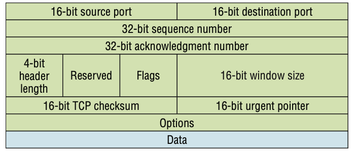
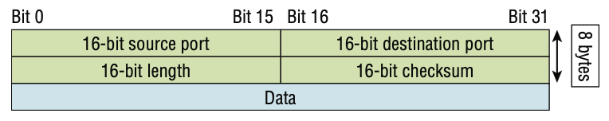
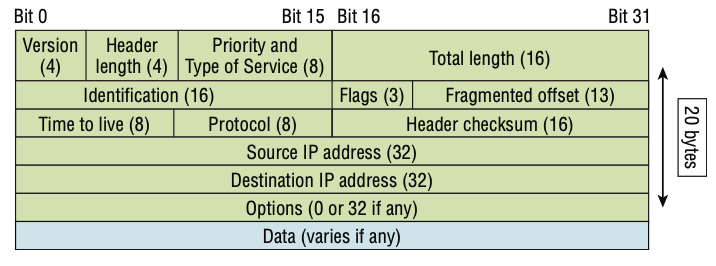
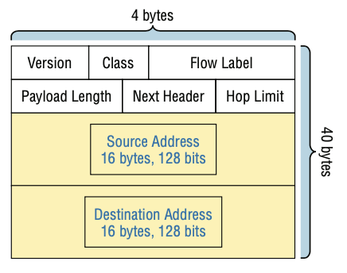
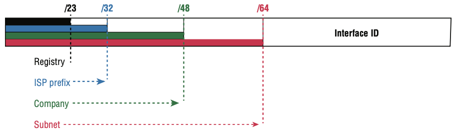

# 1. Network Fundamentals (20%)

## 1.1. Explain the role and function of network components

### 1.1.a. Routers

- `Router` is a device that connects two networks and allows packets to be transmitted and received between them
- Operates at layer 3 (`Network layer`) to filter the network based on IP address
- Don't forward broadcast packets from networks so it breaks up `broadcast domain`
- Determines the best path for data packets from source to destination based on routing table information

### 1.1.b. Layer 2 and Layer 3 switches

- `Switch` is a network device that operates at layer 2 (`Data Link layer`) to perform functionalities such as filtering, flooding and forwarding frames.
- Layer 2 switching is considered hardware-based bridging because it uses specialized hardware called an `application-specific integrated circuit (ASIC)`.
  - MAC table is stored in a `TCAM (Ternary Content-Addressable Memory)`.
  - ASIC feeds the destination MAC address of frame into TCAM, which returns the matching table entry.
  - ASICs can run up to high gigabit speeds with very low latency rates.
- `Layer 3 (Multilayer)` switch is a switch that is capable of both switching and routing (layer 3 aware).
  - Can assign IP addresses to its interfaces
  - Can create virtual interfaces for each VLAN and assign IP addresses to those interface
  - Can configure routes on it to be used for inter-VLAN routing
  - Preferred over ROAS in large network because lots of traffic in one interface can cause congestion

### 1.1.c. Next-generation firewalls and IPS

- `Firewall` is a combination of hardware and software that monitors and controls network traffic based on configured rules.
  - `Network firewalls` are physical hardware firewalls and `host-based firewalls` are software firewalls.
- `Next-generation firewalls` include more modern and advanced filtering capabilities.
  - It provides full packet reassembly and deep-packet inspection up to and through layer 7.
  - It permits `application visibility and control (AVC)` as well as offer `intrusion prevention system (IPS)` policies, which monitor a network for malicious and takes action to prevent it.

### 1.1.d. Access points

- A `wireless access point (WAP)` is a networking device that allows wireless-capable devices to connect to a wired network.
- APs have the following characteristics:
  - Function as a central junction point for the wireless stations
  - Function as a bridge to the wired network, giving the wireless station access to the wired network and/or the internet
  - SOHO APs usually include functions like NAT and DHCP

### 1.1.e. Controllers (Cisco DNA Center and WLC)

- `WLAN Controller` is responsible for centrally managing multiple wireless network access points.
- In split-MAC architecture, there are 4 main WLC deployment models:

  - `Unified`: WLC is hardware appliance in a central location of the network.
  - `Cloud-based`: WLC is a VM running on a server, typically in a private cloud in a data center
  - `Embedded`: WLC is embedded within a switch
  - `Cisco Mobility Express`: WLC is embedded within an AP

- `Cisco DNA (Digital Network Architecture) Center` is the SDN controller in `SD-Access` which is Cisco's SDN solution for automating campus LANs.
  - It is an application installed on Cisco UCS server hardware
  - It has REST API that can be used to interact with DNA center.
  - It enables `Intent-Based Networking (IBN)` where engineer defines the intent of network behaviour and DNA Center will take care of the details of the configurations.

### 1.1.f. Endpoints

- `Endpoints` are basically just something that connects to the network through a wired or wireless connection.
- Common endpoints include:
  - Desktops/Laptops
  - Mobile phones
  - Access points
  - IP phones
  - Internet of Things

### 1.1.g. Servers

- `Server` is a device that provides functions or services for clients.
- `Client` is a device that accesses a service made available by a server.
- The same device can both be a client and a server.

### 1.1.h. PoE

- `Power over Ethernet (PoE)` is a protocol that allows power to be sent over unused wires in an Ethernet cable to provide power to devices.
- PoE has a process to determine if a connected device needs power and how much power it needs.

## 1.2. Describe characteristics of network topology architectures

### 1.2.a. Two-tier

- Consists of two layers: access layer and distribution layer
  - `Access Layer` is the one end hosts connect to. It is where QoS marking, security services, etc. are performed.
  - `Distribution Layer` aggregates connections from the access layer switches and it connects to services such as Internet, WAN, etc.
- Also called a `collapsed-core design` because it omits a core layer in 3-tier design
- More economical than 3-tier while being very functional in a campus environment, where the network may not grow larger over time.

### 1.2.b. Three-tier

- This architecture contains additional core layer on top of two-tier architecture design.
- `Core Layer` connects distribution layers together in large LAN.
  - Speed is important at this layer, thus CPU-intensive operation should be avoided.
  - High reliability is a key as failure in this layer can affect all users in the network.

### 1.2.c. Spine-leaf

- `Spine-leaf` architecture is an architecture used commonly in data centers.
- Every leaf switches are connected to every spine switches and every spine switches are connected to every leaf switches
- Path taken by traffic is randomly chosen to balance the traffic load among the spine switches.
- Each server is separated by same number of hops, providing consistent latency.
- This helps data center to deal with large amount of east-west traffic in distributed virtual servers.

### 1.2.d. WAN

- `WAN (Wide Area Network)` is used to connect geographically separate LANs. It uses the services of ISPs. It uses serial connections of various types to provide access to bandwidth over large geographic areas.

#### WAN Terminologies

- `Customer Premises Equipment (CPE)` is equipment that's owned by the subscriber and located on the subscriber's premises.
- `CSU/DSU (Channel ServiceUnit/Data Service Unit)` is a device that's used to connect a DTE to a digital circuit like T1/T3 line.
  - A device is considered DTE if it's either a source or destination for digital data.
- `Demarcation point` is the precise spot where the service provider's responsibility ends and CPE begins.
- `Local loop` connects the demarc to the closest central office.
- `Central office (CO)` connects the customer's network to the provider's switching network.
- `Toll network` is a trunk line inside a WAN provider's network.
- `Optical fiber converters` is used to convert optical signals into electrical signals and vice versa.

#### WAN Connection Bandwidth

| **Name** | **Description**                                        | **Bandwidth** |
| -------- | ------------------------------------------------------ | ------------- |
| DS0      | The basic digital signaling rate                       | 64 Kbps       |
| T1 (DS1) | 24 DS0 bundled together                                | 1.544 Mbps    |
| E1       | European equivalent of T1 with 30 DS0 bundled together | 2.048 Mbps    |
| T3 (DS3) | 28 DS1 bundled together                                | 44.736 Mbps   |
| OC-3     | 3 DS3 bundled together                                 | 155.52 Mbps   |
| OC-12    | 4 OC-3 bundled together                                | 622.08 Mbps   |
| OC-48    | 4 OC-12 bundled together                               | 2488.32 Mbps  |

### 1.2.e. Small office/home office (SOHO)

- `Small Office/Home Office (SOHO)` refers to the office of a small company or a small home office with few devices.
- All networking functions are typically provided by a single device, often called `wireless router`.

### 1.2.f. On-premise and Cloud

- `On-premise` infrastructure has following characteristics:
  - All servers, network devices, and other infrastructure are located on company property
  - All equipment is purchased and owned by the company using it
  - Company is responsible for necessary space, power and cooling
- `Cloud computing` is a model for enabling ubiquitous, convenient, on-demand network access to a shared pool of configurable computing resources and that can be rapidly provisioned and released with minimal management effort or service provider interaction.

#### Five Essential Characteristics of Cloud Computing

1. `On-demand self-service`: customer is able to use the service freely without direct communication to the service provider
2. `Broad network access`: service is available through standard network connections, and can be accessed through many kinds of devices
3. `Resource pooling`: When a customer requests a service, the resources are allowed from a shared pool
4. `Rapid Elasticity`: Customers can quickly expand/reduce the services from a pool of resources
5. `Measured Service`: Provider measures the customer's usage of resources and customers can measure their own as well

#### Three Service Models of Cloud

1. `Software as a Service (SaaS)`: Capability provided to consumer is to use provider's applications on a cloud infrastructure
2. `Platform as a Service (PaaS)`: Capability provided to consumer is to deploy onto the cloud infra, consumer-created applications
3. `Infrastructure as a Service (IaaS)`: Capability provided to consumer is to provision a fundamental computing resources where the consumer is able to deploy and run arbitrary software.

#### Four deployment models of cloud

1. `Private Cloud`: exclusive use by a single organization comprising multiple consumers
2. `Community Cloud`: exclusive use by specific community of consumers from orgs with shared concerns
3. `Public Cloud`: provisioned for open use by the general public
4. `Hybrid Cloud`: composition of two or more distinct cloud infra that remain unique entities but bound together by a technology that enables data and application portability

#### Benefits of Cloud Computing

- Cost: CapEx of buying hardware and software and reduced or eliminated
- Global scale: services can be offered to customers from a geographic location close to them
- Speed / Agility: services are provided on demand quickly
- Productivity: Remove the need for many time-consuming tasks
- Reliability: Easy to back up in the cloud

## 1.3. Compare physical interface and cabling types

### 1.3.a. Single-mode fiber, multimode fiber, copper

- `UTP (Unshielded Twisted Pair) Cables` are copper wire cables under Ethernet standards.
  - `RJ-45` is the connector used at the ends of a copper Ethernet cable.
- `Fiber optic cables` send data by sending light over glass fibers.
  - `SFP (Small Form-Factor Pluggable) transceiver` is used for fiber optic cables.
  - It consists of 4 layers: `fiber glass core`, where light is transmitted, `cladding`, which reflects the light, `protective buffer` and `outer jacket`.

#### UTP vs Fiber Optic

- UTP is cheaper than fiber optic
- UTP covers shorter distance than fiber optic
- UTP is vulnerable to EMI but fiber optic is not
- UTP emits a faint signal outside the wire, which can be a security risk

#### Multimode vs single-mode

- `Single-mode` has a tighter cladding so it only allows one mode of light down the fiber whereas `multimode` is looser and allows multiple light to travel down the glass.
  - Single-mode allows longer cable than multimode.
  - Multimode is cheaper than single-mode because LED based SFP is cheaper than laser based SFP.

### 1.3.b. Connections (Ethernet shared media and point-to-point)

- `Point-to-point` connection/network is formed when exactly two computers are connected to each other with access to full channel bandwidth. It provides security and privacy because communication channel is not shared.
- `Ethernet` is a collection of network protocols and standards.
- `Ethernet standard` defines configuration of cables and speeds to be used for communication

| **Speed** | **Common Name**  | **IEEE Standard** | **Informal Name** | **Max Cable Length** |
| :-------: | :--------------: | :---------------: | :---------------: | :------------------: |
|  10 Mbps  |     Ethernet     |      802.3i       |     10 BASE-T     |         100m         |
| 100 Mbps  |  Fast Ethernet   |      802.3u       |    100 BASE-T     |         100m         |
|  1 Gbps   | Gigabit Ethernet |      802.3ab      |    1000 BASE-T    |         100m         |
|  10 Gbps  | 10 Gig Ethernet  |      802.3an      |    10G BASE-T     |         100m         |

| **Speed** | **IEEE Standard** | **Informal Name** | **Cable Type** | **Max Cable Length** |
| :-------: | :---------------: | :---------------: | :------------: | :------------------: |
|  1 Gbps   |      802.3z       |   1000 BASE-LX    | Multi / Single | 500m (MM) / 5km (SM) |
|  10 Gbps  |      802.3ae      |    10G BASE-SR    |     Multi      |         400m         |
|  10 Gbps  |      802.3ae      |    10G BASE-LR    |     Single     |         10km         |
|  10 Gbps  |      802.3ae      |    10G BASE-ER    |     Single     |         30km         |

#### Ethernet Cabling

- In `Straight-through cable`, pins are connected to the same number pin. It's used to connect host/router to switch or hub.
- `Crossover-cable` has reversed pin connections so they are used to connect devices of same pin settings, such as router to host or switch to switch.
- Modern networking devices have `Auto MDI-X` that allows devices to detect which pins their neighbour is transmitting and adjust which pins they use to transmit and receive data so cable type doesn't matter.
- `Rollover cable` is used to connect to the console port of a network device.

## 1.4. Identify interface and cable issues (collisions, errors, mismatch duplex, and/or speed)

- `#show interfaces <int-id>` command can reveal important information that helps identify interface and cable issues:

```
R2#sh int fa0/0
FastEthernet0/0 is up, line protocol is up
[output cut]
Full-duplex, 100Mb/s, 100BaseTX/FX
ARP type: ARPA, ARP Timeout 04:00:00
Last input 00:00:05, output 00:00:01, output hang never
Last clearing of "show interface" counters never
Input queue: 0/75/0/0 (size/max/drops/flushes); Total output drops: 0 Queueing strategy: fifo
Output queue: 0/40 (size/max)
5 minute input rate 0 bits/sec, 0 packets/sec
5 minute output rate 0 bits/sec, 0 packets/sec
1325 packets input, 157823 bytes
Received 1157 broadcasts (0 IP multicasts)
0 runts, 0 giants, 0 throttles
0 input errors, 0 CRC, 0 frame, 0 overrun, 0 ignored
0 watchdog
0 input packets with dribble condition detected
2294 packets output, 244630 bytes, 0 underruns
0 output errors, 0 collisions, 3 interface resets
347 unknown protocol drops
0 babbles, 0 late collision, 0 deferred
4 lost carrier, 0 no carrier
0 output buffer failures, 0 output buffers swapped out
```

#### Speed / Duplex Autonegotiation

- Interfaces that can run at different speeds have default settings of speed auto and duplex auto.
- Interfaces advertise their capabilities to the neighbouring device and they negotiate the best speed and duplex settings they are both capable of.

#### Duplex Mismatch

- `Half duplex`: The device can't send and receive data at the same time. If it is receiving a frame, it must wait before sending a frame.
- `Full duplex`: The device can send and receive data at the same time. It doesn't have to wait.
- This duplex setting must matched between the two connected interfaces, or collisions will occur.
- `(config-if)#duplex [auto|full|half]` is used to manually configure the duplex settings.

#### Speed Mismatch

- If the speed settings between two interfaces don't match, the connection will not be established between them.
- `(config-if)#speed <speed-mbps>` is used to manually configure the speed settings.

#### Input/output queue drops

- If the `input queue drops` counter increments, it signifies that more traffic is being delivered to the router than it can process.
- `Output queue drops` counter indicates that packets were dropped due to interface congestion, leading to packet drops and queuing delays.

#### Interface Errors

- `Runts`: frames that are smaller than the minimum frame size (64 bytes)
- `Giants`: frames that are larger than the maximum frame size (1518 bytes)
- `CRC`: frames that failed the CRC check
- `Frame`: frames that have incorrect format
- `Input errors`: total number of various error counters
- `Output errors`: frames that the switch tried to send but failed due to error

## 1.5. Compare TCP to UDP

### TCP (Transmission Control Protocol)

- Connection-oriented: before sending data, two hosts communicate to establish a connection first via `three-way handshake`, then data exchange begins. Even when terminating a connection, `four-way handshake` must take place.
- Provides reliable communication through acknowledging that it received TCP segments. If not acknowledged, they are sent again.
- Provides sequencing through a sequence number in TCP header which allow hosts to put segments in correct order.
- Flow control: destination host can tell the source host to increase or decrease the rate at which data is sent.

#### TCP Segment Format



- `Source/Destination port` is the port number of the application on the source/destination.
- `Sequence number`: used by TCP to put the data back in the correct order
- `Acknowledgement number`: value of TCP octet that is expected next
- `Header length`: the number of 32-bit words in the TCP header to indicate where the data begins
- `Reserved`: always set to 0
- `Code bits/flags`: controls functions used to set up and terminate a session
- `Window`: the window size the sender is willing to accept in octets
- `Checksum`: the value of CRC check
- `Urgent`: Use if urgent pointer in the code bits is set. This value indicates the offset from the current sequence number, in octets.

### UDP (User Datagram Protocol)

- Connectionless: doesn't establish connection
- No reliable communication: even if segment is lost, doesn't retransmit
- No sequencing
- No flow control



### TCP vs UDP

|       **TCP**       |           **UDP**            |
| :-----------------: | :--------------------------: |
|      Sequenced      |         Unsequenced          |
|      Reliable       |          Unreliable          |
| Connection-oriented |        Connectionless        |
|   Virtual circuit   |         Low overhead         |
| Window flow control | No windowing or flow control |

### Port Numbers

- TCP
  - 20: FTP data
  - 21: FTP control
  - 22: SSH
  - 23: Telnet
  - 25: SMTP
  - 80: HTTP
  - 110: POP3
  - 443: HTTPS
- UDP
  - 67: DHCP server
  - 68: DHCP client
  - 69: TFTP
  - 161: SNMP agent
  - 162: SNMP manager
  - 514: Syslog
- TCP & UDP
  - 53: DNS

## 1.6. Configure and verify IPv4 addressing and subnetting

### IPv4 Header



- `Version`: IP version number
- `Header length`: Length of header in 32-bit words. Value of range between 5-15,
- `Priority and Type of Service`:
  - `DSCP (Differentiated Services Code Point)`: 6 bits, used for QoS
  - `ECN (Explicit Congestion Notification)`: 2 bits, provides end-to-end notification of network congestion without dropping packets
- `Total length`: length of the whole packet measured in bytes. Ranges between 20-65535
- `Identification`: Unique value used to identify fragmented packets from different datagrams.
- `Flags`:
  - Bit 0: reserved, always 0
  - Bit 1: `Don't fragment (DF) bit`, used to indicate a packet that should not be fragmented
  - Bit 2: `More fragments (MF) bit`, set to 1 if there are more fragments in the packet, set to 0 for the last fragment.
- `Fragment Offset`: indicates the position of the fragment within the original unfragmented IP packet to allow them to be reassembled.
- `Time To Live`: router drops a packet with a TTL of 0. Used to prevent infinite loops.
- `Protocol`: indicates the protocol of the encapsulated L4PDU (TCP = 6, UDP = 17, ICMP = 1, OSPF = 89)
- `Header checksum`: used to check for errors via CRC
- `Source / Destination IP address`
- `Options`: used for network testing, debugging, security and more

### Class of IPv4 Addresses

| **Class** | **First Octet** | **First Octet Range** |
| :-------: | :-------------: | :-------------------: |
|     A     |    0XXXXXXX     |        0 - 127        |
|     B     |    10XXXXXX     |       128 - 191       |
|     C     |    110XXXXX     |       192 - 223       |
|     D     |    1110XXXX     |       224 - 239       |
|     E     |    1111XXXX     |       240 - 255       |

- Class D is reserved for multicast addresses.
- Class E is reserved for experimental use.

### Reserved IP Addresses

|        **Address**        |                 **Function**                  |
| :-----------------------: | :-------------------------------------------: |
| Network address of all 0s |       Indicates this network or segment       |
| Network address of all 1s |            Indicates all networks             |
|     Network 127.0.0.0     |          Reserved for loopback tests          |
|  Node address of all 0s   |           Indicates network address           |
|  Node address of all 1s   |       Indicates all nodes on a network        |
|   Entire address of 0s    |            Indicates default route            |
|   Entire address of 1s    | Broadcast to all nodes on the current network |

### CIDR (Classless Inter-Domain Routing)

- Removed the requirements of class networks and it can be any prefix length
- This allowed larger networks to be split into smaller networks called `subnets`, allowing greater efficiency.

### Subnetting Tricks

- _How many subnets?_ `2^x = number of subnets` where x = number of borrowed bits
- _How many hosts per subnet?_ `2^y - 2 = number of hosts per subnet` where y is the number of unmasked bits
- _What are the valid subnets?_ `256 - subnet mask = block size`. Then incrementing by the block size repeatedly gives all the valid subnets
- _What's the network/broadcast address of each subnet?_ It's the first and last usable address in the subnet
- _What are the valid hosts?_ All addresses except network and broadcast address are valid host addresses in the subnet

### VLSM (Variable-Length Subnet Masks)

- `VLSM` is the process of creating subnets of different sizes to make use of network addresses more efficiently.
- Assigning subnet should be done with the largest subnet and with decreasing size of it

### Configuring and verify IPv4 Addresses

- `(config-if)#ip address <ipv4-addr> <subnet-mask>` configures the IPv4 address of an interface
- `#show ip interfaces brief` is an easy way to check an IP address of interfaces as well as other information about them

## 1.7. Describe the need for private IPv4 addressing

- Private IP addresses used to preserve IP addresses on global Internet by allowing devices in local network to be able to communicate with each other by using private IP addresses that can only be used within the network instead of having to assign a global IP address to it.

| **Address Class** | **Address Range** |         **Addresses**         |
| :---------------: | :---------------: | :---------------------------: |
|      Class A      |    10.0.0.0/8     |   10.0.0.0 - 10.255.255.255   |
|      Class B      |   172.16.0.0/12   |  172.16.0.0 - 172.31.255.255  |
|      Class C      |  192.168.0.0/16   | 192.168.0.0 - 192.168.255.255 |

## 1.8. Configure and verify IPv6 addressing and prefix

### IPv6

`2001:db8:3c4d:12::1234:56ab`

- It is required because there aren't enough IPv4 addresses available.
- 128 bits address
- Written in hexadecimal characters
- 8 groups of 4 characters divided by colon
- Leading 0s in each group can be removed
- Consecutive quartets of all 0s can be replaced with double colon and it can only be done once.

### IPv6 Header



- `Version`: version of IP that is 6
- `Traffic Class`: used for QoS, to indicate high-priority traffic
- `Flow Label`: used to identify specific traffic flows
- `Payload Length`: indicates the length of the payload in bytes
- `Next Header`: indicates the type of next header
- `Hop Limit`: decreased by 1 by each router that forwards it. If it reaches 0, packet is discarded.
- `Source / Destination Address`

#### IPv4 Header vs IPv6 Header

- Inter Header Length field was removed because IPv6 header is fixed at 40 bytes.
- In IPv6, routers no longer process fragmentation so the host is responsible for it.
- Header Checksum is removed because most Data Link layer technologies already perform checksum.

### Configuring and Verifying IPv6 Addresses

- `(config)#ipv6 unicast-routing` allows the router to perform IPv6 routing
- `(config-if)#ipv6 address <ipv6-addr/prefix>` to assign IPv6 address to interface
- `#show ipv6 interface brief` to see a summary of IPv6 assigned

## 1.9. Describe IPv6 address types

### 1.9.a. Unicast (global, unique local, and link local)

#### Global Unicast Address



- Public address which can be used over the Internet
- Originally defined as the `2000::/3` block but now defined as all addresses which aren't reserveed for other purposes

#### Unique Local Address

- Private addresses which can't be used over Internet
- Uses address block `FC00::/7` but later update requires 8th bit to be 1, so it starts with `FD`

#### Link-local Addresses

- Automatically generated on IPv6-enabled interfaces
  - `(config-if)#ipv6 enable` enables IPv6 on an interface
- Uses address block `FE80::/10`
- Link-local means that these addresses are used for communication within a single link (subnet)
- Common uses of link-local addresses:
  - Routing protocol peerings
  - Next-hop addresses for static routes
  - Neighbour discovery protocol

### 1.9.b. Anycast

- `one-to-one-of-many` connection
- Multiple routers are configured with the same IPv6 anycast address and when hosts send packets, routers will forward it to the nearest router configured with that IP.
- No specific address range
- `(config-if)#ipv6 address <ipv6-addr> anycast` to configure anycast address

### 1.9.c. Multicast

- `one-to-many` communication
- Uses `FF00::/8` address block

|    **Purpose**    | **IPv6 Address** | **IPv4 Address** |
| :---------------: | :--------------: | :--------------: |
|     All nodes     |     FF02::1      |    224.0.0.1     |
|    All routers    |     FF02::2      |    224.0.0.2     |
| All OSPF routers  |     FF02::5      |    224.0.0.5     |
| All OSPF DRs/BDRs |     FF02::6      |    224.0.0.6     |
|  All RIP routers  |     FF02::9      |    224.0.0.9     |
| All EIGRP routers |     FF02::A      |    224.0.0.10    |

#### Multicast Scopes

- IPv6 defines multiple multicast scopes which indicate how far the packet should be forwarded
- `Interface-local (FF01)`: the packet doesn't leave the local device
- `Link-local (FF02)`: the packet remains in the local subnet
- `Site-local (FF06)`: the packet can be forwarded by routers but should be limited to a single physical domain
- `Organization-local (FF08)`: Wider scope than site-local
- `Global (FF0E)`: No boundaries

### 1.9.d. Modified EUI 64

- `EUI-64` is a method of converting MAC address into a 64-bit interface identifier.
- This interface identifier can then become the host portion of a /64 IPv6 address
- Conversion steps:
  1. Divide MAC address in half
  2. Insert FFFE in the middle
  3. Invert the 7th bit
- `(config-if)#ipv6 address <network/prefix> eui-64` to use EUI-64 to generate an IPv6 address

### Other IPv6 Addresses

- `::`: Unspecified address
  - Can be used when a device doesn't know its IPv6 address
  - IPv6 default routes are configured to `::/0`
  - IPv4 equivalent: 0.0.0.0
- `::1`: Loopback address
  - Used to test protocol stack on local device
  - Messages sent to this address are processed within local device

## 1.10. Verify IP parameters for Client OS (Windows, Mac OS, Linux)

- `ping`: uses ICMP echo request and replies to test if a node IP stack is initialized and alive on the network
- `traceroute`: displays the list of routers on a path to a network destination (Cisco router only)
- `tracert`: same as traceroute but Windows only
- `arp -a`: displays IP-to-MAC mappings on Windows PC
- `#show ip arp`: displays ARP table on a Cisco router
- `ipconfig /all`: used by Windows to show PC network configuration
- `ifconfig`: used by MAC and Linux to get IP address details of local machine
- `ipconfig getifaddr en0`: find my IP address if I'm connected to a wireless network or `en1` if I'm connected to Ethernet for MAC and Linux.
- `curl ifconfig.me`: display my global Internet IP address in terminal for MAC and Linux

## 1.11. Describe wireless principles

### 1.11.a. Nonoverlapping Wi-Fi channels

- Wi-Fi uses two main bands: `2.4 GHz` and `5 GHz` bands.
  - 2.4 GHz band typically provides further reach in open space and has better penetration of obstacles although bandwidth is lower.
- Each band is divided up into multiple `channels`, where devices can transmit and receive traffic.
- It is important the APs don't use overlapping channels because it can cause interference and lower throughput.
- Therefore, you can place APs in a honeycomb pattern to provide complete coverage of an area without interference between channels.
- In 2.4 GHz band, it's recommended to use channels `1, 6 and 11`.

### 1.11.b. SSID

- `SSID (Service Set Identifier)` is an ID that consists of 32 characters human readable name that identifies the service set.
- `BSSID (Basic Service Set Identifier)` is used to uniquely identify the AP and it's derived from the MAC address of the AP's radio interface.
- `MBSSID (Multiple Basic Service Set Identifier)` is derived from the MAC address of the radio interface if multiple SSIDs are used on the same AP.

### 1.11.c. RF

- To send wireless signals, the sender applies an alternating current to antenna, creating electromagnetic fields which propagate out as waves.
- There are many characteristics of RF that negatively affect trasmissions:
  - `Free space path loss`: signla is weakened the further it travels
  - `Absorption`: signal is absorbed by obstacles
  - `Multipath`: signals sent from the same AP arrives out of phase due to different paths taken
  - `Reflection`, `Diffraction` and `Scattering` of signal also takes place when it interacts with the surface

### 1.11.d. Encryption

- Encryption in wireless communication is important because signals can be received by any device in vicinity.
- Each client will use a unique encryption/decryption key so that other devices can't read its traffic.
- `Group key` is used by AP to encrypt traffic that it wants to send to all of its clients and all clients associated with the AP keep that key.

## 1.12. Explain virtualization fundamentals (server virtualization, containers, and VRFs)

### Virtualization

- `Virtualization` allows multiple OSs to run on a single physical server.
- Each instance is called a `VM (Virtual Machine)`
- `Hypervisor` is used to manage and allocate hardware resources to each VM
  - The type of hypervisor that runs directly on top of hardware is called `Type 1 hypervisor`
  - `Type 2 hypervisors` run as a program on OS like a regular computer program

#### Why Virtualization?

- `Partitioning`: Run multiple OS in one machine by dividing system resources between VMs
- `Isolation`: Fault & security isolation at hardware level
- `Encapsulation`: Save entire state of VM to files
- `Hardware Independence`: Provision or migrate any VM to any physical server

### Containers

- `Containers` are software packages that contain an App and all dependencies for the contained App to run.
- Run on a `container engine` that runs on a host OS
- Lightweight and include only dependencies required to run the specific App
- `Container orchestrator` is a software platform for automating the deployment, management, scaling, etc. of containers

#### VMs vs Containers

- VMs can take minutes to boot up but containers can boot up in milliseconds
- VMs take up more disk space than containers
- VMs use more CPU/RAM resources than containers
- VMs are more isolated because each VM runs its own OS

### VRF

- `VRF (Virtual Routing and Forwarding)` are used to divide a single router into multiple virtual routers.
- Achieved by allowing a router to build separate routing tables
- Traffic in one VRF cannot be forwarded out of an interface in another VRF unless VRF leaking is configured.
- Commonly used by service providers to allow one device to carry traffic from multiple customers so that customer's traffic is isolated from the others.

## 1.13. Describe switching concepts

### 1.13.a. MAC learning and aging

- Switch has a `MAC address table`, which saves mapping of interface to source MAC address when it receives a frame.
- When MAC address is saved this way, it's called dynamically learned MAC address
- MAC addresses are removed after 5 minutes of inactivity (`aging`)

### 1.13.b. Frame switching

- When switch receives a frame of destination address that is saved in MAC address table, it simply transmit the frame out of the interface.

### 1.13.c. Frame flooding

- If the destination address is not saved in the table, it floods the frame to all interfaces except the source.
- If the received end doesn't have a matching MAC address, it simply drops the packet.

### 1.13.d. MAC address table

- Switche saves all the MAC addresses it encountered in MAC address table.
- MAC address table can be viewed via `#show mac address-table`
- `#clear mac address-table dynamic` can remove MAC addresses
